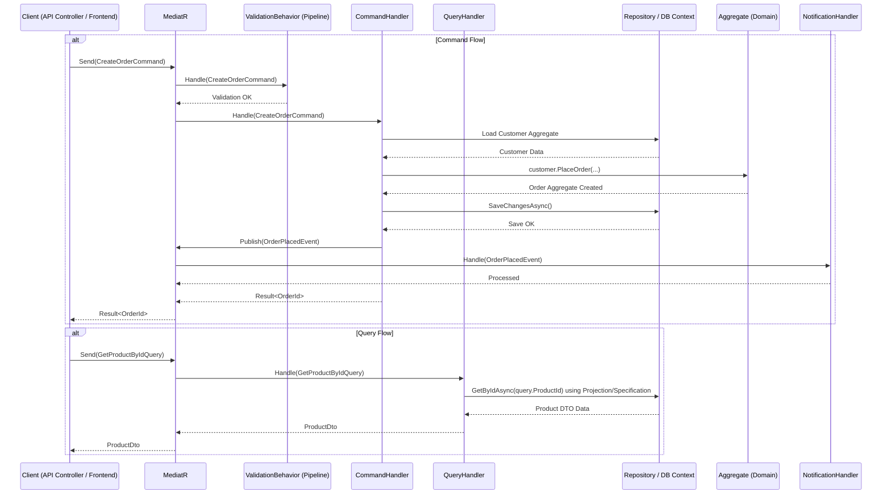
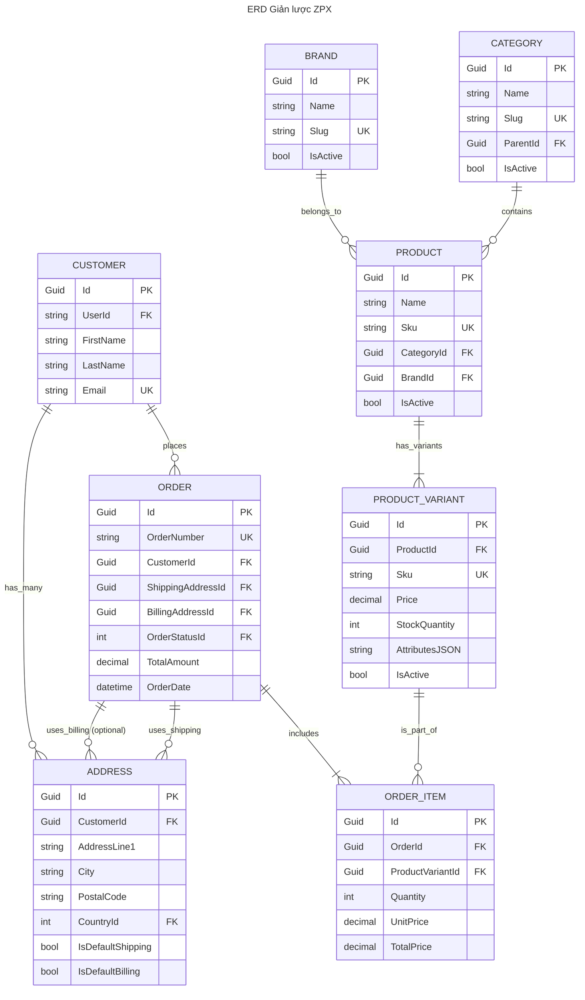

# Tuyệt vời

## Dựa trên tài liệu phân tích thiết kế chi tiết và trang `Home.md` bạn cung cấp, tôi sẽ tạo nội dung cho các trang Wiki trên GitHub cho dự án ZylPeloxStore

**Lưu ý:**

- Các đường link nội bộ Wiki (`/wiki/...`) sẽ hoạt động chính xác khi bạn tạo các trang này trên GitHub Wiki.
- Các đường link đến file/thư mục trong repo sử dụng nhánh `master` như yêu cầu.
- Các sơ đồ Mermaid được tích hợp sẵn.
- Mỗi file Markdown sẽ có comment `<!-- START OF FILE ... -->` và `<!-- END OF FILE ... -->`.
- Tôi sẽ cố gắng chi tiết hóa nội dung dựa trên tài liệu gốc, nhưng một số phần (như Component Library, API Docs chi tiết) có thể cần được cập nhật thêm khi dự án tiến triển.

---

### 1. Trang Chính (Home.md)

````markdown
<!-- START OF FILE Home.md -->

# 📚 ZylPeloxStore - Tài Liệu Chính Thức


## 👋 Giới Thiệu

ZylPeloxStore (ZPX) là một nền tảng eCommerce toàn diện được xây dựng trên kiến trúc **Clean Architecture**, sử dụng **ASP.NET Core 6+** cho backend và **Angular 16+** cho frontend. Hệ thống được thiết kế để hoạt động với hiệu suất cao, có khả năng mở rộng và bảo mật tốt, đáp ứng nhu cầu kinh doanh đa kênh.

**Mã dự án:** ZPX-ECOM
**Phiên bản hiện tại:** 1.0 (Xem [Changelog](https://github.com/phamtiendungcw/ZylPeloxStore/wiki/Changelog))
**Trạng thái dự án:** Đang phát triển (Theo dõi tại [Project Board](https://github.com/users/phamtiendungcw/projects/13))
**Người duy trì chính:** [@phamtiendungcw](https://github.com/phamtiendungcw)
**Repository:** [`phamtiendungcw/ZylPeloxStore`](https://github.com/phamtiendungcw/ZylPeloxStore)

## 🗺️ Điều Hướng Wiki

### Bắt Đầu

- [Tổng quan dự án (Overview)](https://github.com/phamtiendungcw/ZylPeloxStore/wiki/Overview)
- [Cài đặt môi trường (Setup)](https://github.com/phamtiendungcw/ZylPeloxStore/wiki/Setup)
- [Quy trình phát triển (Development Workflow)](https://github.com/phamtiendungcw/ZylPeloxStore/wiki/Development-Workflow)

### Kiến Trúc & Thiết Kế

- [Kiến trúc Tổng thể (Architecture)](https://github.com/phamtiendungcw/ZylPeloxStore/wiki/Architecture)
- [Domain-Driven Design (DDD)](https://github.com/phamtiendungcw/ZylPeloxStore/wiki/Domain-Driven-Design)
- [CQRS Pattern](https://github.com/phamtiendungcw/ZylPeloxStore/wiki/CQRS)
- [Cấu trúc Database (Database Schema)](https://github.com/phamtiendungcw/ZylPeloxStore/wiki/Database-Schema)

### Hướng Dẫn Phát Triển

- [Coding Standards](https://github.com/phamtiendungcw/ZylPeloxStore/wiki/Coding-Standards)
- [Quy tắc Git (Git Guidelines)](https://github.com/phamtiendungcw/ZylPeloxStore/wiki/Git-Guidelines)
- [Chiến lược Kiểm thử (Testing Strategy)](https://github.com/phamtiendungcw/ZylPeloxStore/wiki/Testing)
- [Tích hợp Bên Thứ Ba (Third-Party Integration)](https://github.com/phamtiendungcw/ZylPeloxStore/wiki/Third-Party-Integration)

### Tài Liệu API & Frontend

- [Tài liệu REST API (API Docs)](https://github.com/phamtiendungcw/ZylPeloxStore/wiki/API-Docs)
- [Kiến trúc Frontend (Frontend Architecture)](https://github.com/phamtiendungcw/ZylPeloxStore/wiki/Frontend)
- [Thư viện Component (Component Library)](https://github.com/phamtiendungcw/ZylPeloxStore/wiki/Component-Library)

### Triển Khai & DevOps

- [CI/CD Pipeline](https://github.com/phamtiendungcw/ZylPeloxStore/wiki/CI-CD)
- [Hướng dẫn Triển khai (Deployment Guide)](https://github.com/phamtiendungcw/ZylPeloxStore/wiki/Deployment)
- [Quản lý Cấu hình (Configuration)](https://github.com/phamtiendungcw/ZylPeloxStore/wiki/Configuration)
- [Giám sát & Logging (Monitoring & Logging)](https://github.com/phamtiendungcw/ZylPeloxStore/wiki/Monitoring)

### Khác

- [Câu hỏi thường gặp (FAQ)](https://github.com/phamtiendungcw/ZylPeloxStore/wiki/Frequently-Asked-Questions)
- [Lịch sử thay đổi (Changelog)](https://github.com/phamtiendungcw/ZylPeloxStore/wiki/Changelog)
- [Lộ trình Phát triển (Roadmap)](https://github.com/phamtiendungcw/ZylPeloxStore/wiki/Roadmap)
- [Hướng dẫn Đóng góp (Contributing)](https://github.com/phamtiendungcw/ZylPeloxStore/wiki/Contributing)
- [Giấy phép (License)](https://github.com/phamtiendungcw/ZylPeloxStore/blob/master/LICENSE.txt)

## 🚀 Bắt Đầu Nhanh

Xem chi tiết tại trang [Cài đặt môi trường (Setup)](https://github.com/phamtiendungcw/ZylPeloxStore/wiki/Setup).

```bash
# 1. Clone repository
git clone https://github.com/phamtiendungcw/ZylPeloxStore.git
cd ZylPeloxStore

# 2. Khôi phục các packages .NET
dotnet restore ZylPeloxStore.sln

# 3. Cấu hình secrets (Ví dụ: Connection String)
cd src/ZPX.Server
dotnet user-secrets init
dotnet user-secrets set "ConnectionStrings:DefaultConnection" "YOUR_CONNECTION_STRING"
# Thêm các secrets khác nếu cần (API Keys, etc.)

# 4. Chạy Database Migrations
dotnet ef database update --project ../ZPX.Persistence --startup-project .

# 5. Chạy Backend API
dotnet run

# 6. Chạy Frontend (trong terminal khác)
cd ../zpx-ui
npm install
npm start # Hoặc ng serve
```

## 📅 Kế Hoạch Phát Triển

Dự án được quản lý và theo dõi tiến độ tại [**ZylPeloxStore Project Board**](https://github.com/users/phamtiendungcw/projects/13).

Lộ trình dự kiến được chia thành các giai đoạn chính:

1. **Phase 1: MVP (Month 1-3)**: Catalog, Order cơ bản, Customer accounts, Admin dashboard, Tích hợp thanh toán cơ bản.
2. **Phase 2: Enhanced Features (Month 4-6)**: Inventory, Advanced search, Promotions & Discounts, Reviews & Ratings, Thêm tùy chọn thanh toán/vận chuyển.
3. **Phase 3: Advanced Features (Month 7-9)**: Analytics & Reporting, Marketing tools (Blog, Email), Tối ưu hóa hiệu năng, (Optional: Multi-vendor, Mobile).

Chi tiết hơn có tại trang [Roadmap](https://github.com/phamtiendungcw/ZylPeloxStore/wiki/Roadmap).

## 👥 Team (Ví dụ)

- **Thiết kế & Kiến trúc:** [@phamtiendungcw](https://github.com/phamtiendungcw)
- **Backend Development:** [@phamtiendungcw](https://github.com/phamtiendungcw)
- **Frontend Development:** [@phamtiendungcw](https://github.com/phamtiendungcw)
- **DevOps:** [@phamtiendungcw](https://github.com/phamtiendungcw)
- **QA:** [@phamtiendungcw](https://github.com/phamtiendungcw)
  _(Cập nhật danh sách thành viên thực tế)_

## 📝 License

Dự án này được cấp phép theo [MIT License](https://github.com/phamtiendungcw/ZylPeloxStore/blob/master/LICENSE.txt).

## 📋 Tài Liệu Phân Tích & Thiết Kế Gốc

Để có cái nhìn sâu sắc và chi tiết nhất về hệ thống, vui lòng tham khảo tài liệu gốc:
[**ZylPeloX Store System Analysis and Design.md**](https://github.com/phamtiendungcw/ZylPeloxStore/blob/master/docs/ZylPeloX%20Store%20System%20Analysis%20and%20Design.md).

---

> _Wiki được duy trì bởi [@phamtiendungcw](https://github.com/phamtiendungcw). Cập nhật lần cuối: 2024-05-06._

<!-- END OF FILE Home.md -->
````

---

### 2. Tổng quan dự án (Overview.md)

````markdown
<!-- START OF FILE Overview.md -->

# 📜 Tổng quan dự án ZylPeloxStore (ZPX)

[**Quay lại Trang Chính**](https://github.com/phamtiendungcw/ZylPeloxStore/wiki)

## 1. Mục tiêu

Mục tiêu chính của dự án ZylPeloxStore (ZPX) là xây dựng một nền tảng cửa hàng bán lẻ trực tuyến hiện đại và toàn diện. Hệ thống hướng đến:

- **Tích hợp đầy đủ:** Cung cấp các tính năng quản lý từ đầu đến cuối (end-to-end) cho hoạt động kinh doanh eCommerce.
- **Kiến trúc Hiện đại:** Áp dụng các nguyên tắc thiết kế như Clean Architecture và Domain-Driven Design để đảm bảo tính linh hoạt, dễ bảo trì và kiểm thử.
- **Đa kênh (Omnichannel Ready):** Thiết kế API-first để dễ dàng tích hợp với các kênh bán hàng khác (Mobile App, POS, Marketplaces) trong tương lai.
- **Khả năng Mở rộng (Scalability):** Có khả năng xử lý khối lượng dữ liệu và truy cập người dùng từ trung bình đến lớn.
- **Dễ Bảo trì (Maintainability):** Cấu trúc code rõ ràng, tách biệt các mối quan tâm giúp việc sửa lỗi và thêm tính năng mới trở nên dễ dàng hơn.

Tham khảo chi tiết trong [Tài liệu Phân tích & Thiết kế Gốc (Mục 1.1)](https://github.com/phamtiendungcw/ZylPeloxStore/blob/master/docs/ZylPeloX%20Store%20System%20Analysis%20and%20Design.md#11-mục-tiêu).

## 2. Phạm vi

Hệ thống ZPX bao gồm các module và chức năng chính sau:

- **Quản lý Catalog Sản phẩm:**
  - Quản lý sản phẩm đơn giản và sản phẩm có biến thể (màu sắc, kích thước...).
  - Quản lý danh mục đa cấp.
  - Quản lý hình ảnh, video sản phẩm (tích hợp CDN).
  - Quản lý thuộc tính, thông số kỹ thuật.
- **Quản lý Khách hàng (CRM):**
  - Hồ sơ khách hàng chi tiết, lịch sử mua hàng.
  - Phân nhóm khách hàng.
  - Quản lý địa chỉ.
  - (Optional) Hệ thống điểm thưởng, đánh giá.
- **Quản lý Kho hàng (Inventory):**
  - Theo dõi tồn kho thời gian thực theo từng biến thể.
  - Quản lý nhập/xuất kho, lịch sử tồn kho.
  - Hỗ trợ nhiều kho (multi-warehouse).
  - Cảnh báo tồn kho thấp.
- **Quản lý Đơn hàng (Order Management):**
  - Quy trình xử lý đơn hàng linh hoạt.
  - Quản lý trạng thái đơn hàng.
  - Lịch sử thay đổi đơn hàng.
  - Xử lý đơn hàng trả lại/hoàn tiền.
- **Quản lý Vận chuyển (Shipping):**
  - Tích hợp API với các đối tác vận chuyển.
  - Cấu hình phí vận chuyển linh hoạt (theo khu vực, trọng lượng...).
  - Theo dõi trạng thái vận chuyển.
  - In ấn vận đơn.
- **Quản lý Thanh toán (Payment):**
  - Tích hợp nhiều cổng thanh toán (Thẻ, Chuyển khoản, Ví điện tử, COD...).
  - Xử lý thanh toán an toàn (PCI DSS compliance).
  - Quản lý giao dịch, hoàn tiền.
- **Khuyến mãi & Giảm giá (Promotions):**
  - Quản lý mã giảm giá (coupon code).
  - Tạo chương trình khuyến mãi theo thời gian, sản phẩm, nhóm khách hàng.
- **Nội dung & Marketing:**
  - Blog, trang nội dung (CMS tích hợp).
  - Công cụ SEO cơ bản.
  - Quản lý đánh giá sản phẩm.
  - (Optional) Email Marketing.
- **Quản trị Hệ thống:**
  - Dashboard báo cáo tổng quan.
  - Quản lý nhân viên và phân quyền chi tiết.
  - Cấu hình hệ thống.
  - Audit log.

Tham khảo chi tiết trong [Tài liệu Phân tích & Thiết kế Gốc (Mục 1.2 & 2)](https://github.com/phamtiendungcw/ZylPeloxStore/blob/master/docs/ZylPeloX%20Store%20System%20Analysis%20and%20Design.md#12-phạm-vi).

## 3. Giới hạn (Ban đầu)

- **Quy mô dữ liệu/truy cập mục tiêu:** Lên đến 100,000 sản phẩm, 50,000 người dùng đồng thời (cần kiểm thử hiệu năng kỹ lưỡng).
- **Thời gian phát triển MVP:** Khoảng 3 tháng (xem [Roadmap](https://github.com/phamtiendungcw/ZylPeloxStore/wiki/Roadmap)).
- **Tập trung ban đầu:** Các tính năng cốt lõi cho việc bán hàng trực tuyến, các tính năng nâng cao sẽ được phát triển trong các giai đoạn sau.

Tham khảo chi tiết trong [Tài liệu Phân tích & Thiết kế Gốc (Mục 1.3)](https://github.com/phamtiendungcw/ZylPeloxStore/blob/master/docs/ZylPeloX%20Store%20System%20Analysis%20and%20Design.md#13-giới-hạn).

---

> _Cập nhật lần cuối: 2024-05-06._

<!-- END OF FILE Overview.md -->
````

---

### 3. Cài đặt môi trường (Setup.md)

````markdown
<!-- START OF FILE Setup.md -->

# 🛠️ Cài đặt môi trường Phát triển ZylPeloxStore

[**Quay lại Trang Chính**](https://github.com/phamtiendungcw/ZylPeloxStore/wiki)

Hướng dẫn này giúp bạn thiết lập môi trường cần thiết để chạy và phát triển dự án ZylPeloxStore trên máy cục bộ.

## 1. Yêu cầu Phần mềm (Prerequisites)

Đảm bảo bạn đã cài đặt các phần mềm sau:

- **.NET SDK:** Phiên bản 6.0 hoặc mới hơn.
  - Kiểm tra: `dotnet --version`
  - Tải về: [https://dotnet.microsoft.com/download](https://dotnet.microsoft.com/download)
- **Node.js & npm:** Phiên bản LTS (Long Term Support) khuyến nghị (ví dụ: 16.x, 18.x). npm thường đi kèm với Node.js.
  - Kiểm tra: `node -v` và `npm -v`
  - Tải về: [https://nodejs.org/](https://nodejs.org/)
- **SQL Server:** Phiên bản Developer (miễn phí) hoặc Express (miễn phí) là đủ cho môi trường phát triển.
  - Tải về: [https://www.microsoft.com/en-us/sql-server/sql-server-downloads](https://www.microsoft.com/en-us/sql-server/sql-server-downloads)
  - Bạn cũng cần một công cụ quản lý DB như [SQL Server Management Studio (SSMS)](https://docs.microsoft.com/en-us/sql/ssms/download-sql-server-management-studio-ssms) hoặc [Azure Data Studio](https://docs.microsoft.com/en-us/sql/azure-data-studio/download-azure-data-studio).
- **Git:** Hệ thống quản lý phiên bản.
  - Kiểm tra: `git --version`
  - Tải về: [https://git-scm.com/downloads](https://git-scm.com/downloads)
- **(Optional) Redis:** Cần thiết nếu bạn muốn sử dụng distributed caching.
  - Có thể chạy Redis qua Docker hoặc cài đặt trực tiếp (Windows có thể dùng [Memurai](https://www.memurai.com/) hoặc WSL).
  - Tải về: [https://redis.io/docs/getting-started/installation/](https://redis.io/docs/getting-started/installation/)
- **(Optional) IDE/Code Editor:**
  - **Visual Studio 2022:** Khuyến nghị cho phát triển .NET.
  - **Visual Studio Code:** Lựa chọn tốt cho cả backend (.NET) và frontend (Angular), cần cài đặt các extensions cần thiết (C#, Angular Essentials...).

## 2. Các bước Cài đặt

1.  **Clone Repository:**

    ```bash
    git clone https://github.com/phamtiendungcw/ZylPeloxStore.git
    cd ZylPeloxStore
    ```

2.  **Cấu hình Kết nối Database:**

    - Mở file `appsettings.Development.json` trong dự án `src/ZPX.Server`.
    - Tìm đến phần `ConnectionStrings`.
    - Cập nhật giá trị `DefaultConnection` để trỏ đến instance SQL Server cục bộ của bạn. Ví dụ:
      ```json
      "ConnectionStrings": {
        "DefaultConnection": "Server=(localdb)\\mssqllocaldb;Database=ZylPeloxStore_Dev;Trusted_Connection=True;MultipleActiveResultSets=true"
        // Hoặc: "Server=YOUR_SERVER_NAME;Database=ZylPeloxStore_Dev;User ID=YOUR_USER;Password=YOUR_PASSWORD;"
      }
      ```
    - **Cách khác (Sử dụng User Secrets - Khuyến nghị):**
      - Mở terminal tại thư mục `src/ZPX.Server`.
      - Chạy lệnh:
        ```bash
        dotnet user-secrets init
        dotnet user-secrets set "ConnectionStrings:DefaultConnection" "YOUR_CONNECTION_STRING"
        ```
      - _Lợi ích: Connection string không bị commit vào Git._

3.  **Cấu hình Redis (Nếu sử dụng):**

    - Cập nhật cấu hình Redis trong `appsettings.Development.json` (hoặc user secrets) nếu bạn đang chạy Redis ở cổng/host khác mặc định (`localhost:6379`).
      ```json
      "CacheSettings": {
        "RedisURL": "localhost:6379"
      }
      ```

4.  **Khôi phục Dependencies:**

    - **Backend (.NET):**
      ```bash
      dotnet restore ZylPeloxStore.sln
      # Hoặc mở solution bằng Visual Studio, nó sẽ tự động restore
      ```
    - **Frontend (Angular):**
      ```bash
      cd src/zpx-ui
      npm install
      ```

5.  **Áp dụng Database Migrations:**

    - Đảm bảo SQL Server instance của bạn đang chạy.
    - Mở terminal tại thư mục `src/ZPX.Server`.
    - Chạy lệnh sau để tạo database và áp dụng các schema migrations:
      ```bash
      dotnet ef database update --project ../ZPX.Persistence --startup-project .
      ```
      _(Lệnh này yêu cầu cài đặt `dotnet-ef` tool. Nếu chưa có, chạy: `dotnet tool install --global dotnet-ef`)_

6.  **Chạy Ứng dụng:**
    - **Chạy Backend API:**
      - Từ terminal tại `src/ZPX.Server`:
        ```bash
        dotnet run
        ```
      - Hoặc nhấn F5/Ctrl+F5 trong Visual Studio (chọn `ZPX.Server` làm Startup Project).
      - API sẽ chạy mặc định tại `https://localhost:7001` và `http://localhost:5001` (kiểm tra file `launchSettings.json`). Bạn có thể truy cập Swagger UI tại `/swagger`.
    - **Chạy Frontend:**
      - Mở một **terminal mới** và điều hướng đến `src/zpx-ui`.
      - Chạy lệnh:
        ```bash
        npm start
        # Hoặc: ng serve --open
        ```
      - Ứng dụng Angular sẽ chạy mặc định tại `http://localhost:4200` và tự động mở trình duyệt.

## 3. Gỡ lỗi (Troubleshooting)

- **Lỗi `dotnet ef`:** Đảm bảo bạn đã cài `dotnet-ef` tool (`dotnet tool install --global dotnet-ef`) và đang chạy lệnh từ thư mục `src/ZPX.Server`.
- **Lỗi kết nối DB:** Kiểm tra lại connection string, đảm bảo SQL Server service đang chạy và cho phép kết nối TCP/IP nếu cần.
- **Lỗi `npm install`:** Thử xóa thư mục `node_modules` và file `package-lock.json` rồi chạy lại `npm install`. Đảm bảo phiên bản Node/npm tương thích.
- **Lỗi CORS khi Frontend gọi API:** Đảm bảo cấu hình CORS trong `Startup.cs` (hoặc `Program.cs` trong .NET 6+) của `ZPX.Server` cho phép origin `http://localhost:4200` trong môi trường Development. Cấu hình mặc định thường đã xử lý việc này.

---

> _Cập nhật lần cuối: 2024-05-06._

<!-- END OF FILE Setup.md -->
````

---

### 4. Quy trình phát triển (Development-Workflow.md)

````markdown
<!-- START OF FILE Development-Workflow.md -->

# 🔄 Quy trình Phát triển Dự án ZPX

[**Quay lại Trang Chính**](https://github.com/phamtiendungcw/ZylPeloxStore/wiki)

Quy trình này mô tả các bước và quy tắc chuẩn khi phát triển tính năng mới hoặc sửa lỗi cho dự án ZylPeloxStore. Mục tiêu là đảm bảo chất lượng code, sự nhất quán và cộng tác hiệu quả.

## 1. Quản lý Công việc

- **Công cụ:** [ZylPeloxStore Project Board](https://github.com/users/phamtiendungcw/projects/13) trên GitHub Projects.
- **Quy trình:**
  1.  **Tạo Issue:** Mọi yêu cầu tính năng mới, bug, task kỹ thuật đều phải được tạo dưới dạng một Issue trên GitHub Repository.
      - Sử dụng các template có sẵn (Bug report, Feature request) nếu phù hợp.
      - Mô tả rõ ràng, cung cấp đủ thông tin (mô tả, bước tái hiện bug, tiêu chí hoàn thành...).
      - Gán nhãn (label), milestone (nếu có) và assign cho người thực hiện (hoặc để trống để team tự nhận).
  2.  **Liên kết Issue với Project Board:** Issue sẽ được tự động hoặc thủ công thêm vào Project Board để theo dõi tiến độ (Todo, In Progress, Done).

## 2. Quy tắc về Branch (Branching Strategy)

Dự án áp dụng chiến lược **Feature Branch Workflow** (tương tự GitHub Flow):

- **`master`:** Nhánh chính, luôn chứa code ổn định, sẵn sàng cho release (production-ready). **Không bao giờ commit trực tiếp lên `master`**.
- **Feature Branches:**
  - Mỗi khi bắt đầu làm một Issue (tính năng mới, bug fix), tạo một nhánh mới từ `master`.
  - **Quy tắc đặt tên nhánh:**
    - Tính năng mới: `feature/issueId-short-description` (ví dụ: `feature/15-product-variant-management`)
    - Sửa lỗi: `fix/issueId-short-description` (ví dụ: `fix/22-fix-login-redirect`)
    - Refactor/Chores: `chore/issueId-short-description` (ví dụ: `chore/30-refactor-order-service`)
  - `issueId` là ID của Issue trên GitHub.

## 3. Quy trình Code & Commit

1.  **Cập nhật `master`:** Trước khi tạo nhánh mới, luôn kéo code mới nhất từ `master`:
    ```bash
    git checkout master
    git pull origin master
    ```
2.  **Tạo và Chuyển sang Nhánh Mới:**
    ```bash
    git checkout -b feature/15-product-variant-management master
    ```
3.  **Phát triển:**
    - Viết code theo [Coding Standards](https://github.com/phamtiendungcw/ZylPeloxStore/wiki/Coding-Standards).
    - Viết Unit Tests và Integration Tests tương ứng (xem [Testing Strategy](https://github.com/phamtiendungcw/ZylPeloxStore/wiki/Testing)).
    - Đảm bảo tất cả các test đều pass trên máy cục bộ.
4.  **Commit Code:**

    - Commit thường xuyên với các thay đổi nhỏ, có ý nghĩa.
    - Sử dụng **Conventional Commits** cho commit message. Xem chi tiết tại [Git Guidelines](https://github.com/phamtiendungcw/ZylPeloxStore/wiki/Git-Guidelines). Ví dụ:

      ```
      feat: Add product variant selection UI

      Implements the UI components for selecting product variants (color, size)
      on the product detail page. Connects to backend API to fetch available variants.

      Ref: #15
      ```

    - `Ref: #issueId` để liên kết commit với Issue.

5.  **Push Nhánh lên Remote:**
    ```bash
    git push origin feature/15-product-variant-management
    ```

## 4. Pull Request (PR) & Code Review

1.  **Tạo Pull Request:**
    - Khi hoàn thành công việc trên nhánh feature, truy cập GitHub repository và tạo Pull Request từ nhánh của bạn vào `master`.
    - **Tiêu đề PR:** Rõ ràng, súc tích, thường bắt đầu bằng loại commit (feat, fix, chore...). Ví dụ: `feat: Implement Product Variant Management`.
    - **Mô tả PR:**
      - Mô tả những gì đã thay đổi.
      - Liên kết đến Issue bằng cách ghi `Closes #15` hoặc `Fixes #22`. GitHub sẽ tự động đóng Issue khi PR được merge.
      - Thêm ảnh chụp màn hình (nếu là thay đổi UI).
      - Ghi chú các điểm cần reviewer chú ý.
    - Gán reviewer(s) cho PR.
2.  **Code Review:**
    - Reviewer sẽ xem xét code dựa trên:
      - Sự đúng đắn của logic.
      - Tuân thủ [Coding Standards](https://github.com/phamtiendungcw/ZylPeloxStore/wiki/Coding-Standards).
      - Độ bao phủ và chất lượng của tests.
      - Hiệu năng và bảo mật (nếu có).
      - Tính dễ đọc, dễ bảo trì.
    - Reviewer để lại comment, câu hỏi hoặc yêu cầu thay đổi.
3.  **Phản hồi & Cập nhật:**
    - Người tạo PR thực hiện các thay đổi theo yêu cầu, commit và push lên nhánh feature (PR sẽ tự động cập nhật).
    - Trao đổi với reviewer nếu có điểm chưa rõ.
4.  **Phê duyệt (Approval):** Khi reviewer hài lòng, họ sẽ phê duyệt PR.

## 5. Merge & Clean-up

1.  **Merge PR:**
    - Sau khi PR được phê duyệt (và các check CI/CD pass - xem [CI/CD Pipeline](https://github.com/phamtiendungcw/ZylPeloxStore/wiki/CI-CD)), người có quyền (thường là Tech Lead hoặc người tạo PR) sẽ merge PR vào `master`.
    - **Sử dụng "Squash and merge" hoặc "Merge commit"** tùy theo quy ước của team (Thường "Squash and merge" được ưa chuộng để giữ lịch sử `master` gọn gàng). Đảm bảo commit message sau khi squash vẫn tuân thủ Conventional Commits và chứa link Issue.
2.  **Xóa Nhánh Feature:** Sau khi merge thành công, xóa nhánh feature trên remote và local:
    ```bash
    # Trên GitHub (thường có nút Delete branch sau khi merge)
    # Dưới local:
    git checkout master
    git pull origin master
    git branch -d feature/15-product-variant-management
    git remote prune origin # Xóa các tham chiếu đến nhánh đã bị xóa trên remote
    ```

## 6. Quy trình Hotfix (Nếu cần)

- Nếu có bug nghiêm trọng trên Production (`master`), tạo nhánh `hotfix/issueId-short-description` từ `master`.
- Thực hiện sửa lỗi, tạo PR vào `master`.
- Sau khi merge hotfix vào `master`, **phải merge `master` ngược lại vào các nhánh feature đang phát triển** (nếu có) để đảm bảo các nhánh này có bản vá lỗi mới nhất.
  ```bash
  git checkout master
  git pull origin master
  git checkout my-feature-branch
  git merge master # Merge hotfix từ master vào feature branch
  # Giải quyết conflict nếu có
  git push origin my-feature-branch
  ```

---

> _Cập nhật lần cuối: 2024-05-06._

<!-- END OF FILE Development-Workflow.md -->
````

---

### 5. Kiến trúc Tổng thể (Architecture.md)

````markdown
<!-- START OF FILE Architecture.md -->

# 🏗️ Kiến trúc Hệ thống ZylPeloxStore

[**Quay lại Trang Chính**](https://github.com/phamtiendungcw/ZylPeloxStore/wiki)

Trang này mô tả kiến trúc phần mềm tổng thể được áp dụng cho dự án ZylPeloxStore (ZPX).

## 1. Nguyên tắc Kiến trúc Cốt lõi

Hệ thống được xây dựng dựa trên các nguyên tắc và mẫu thiết kế sau:

- **Clean Architecture:**

  - **Mục tiêu:** Tách biệt các mối quan tâm (Separation of Concerns), tăng khả năng kiểm thử (Testability) và bảo trì (Maintainability). Giảm sự phụ thuộc vào các yếu tố bên ngoài (UI, Database, Frameworks).
  - **Các lớp chính:**
    - `Domain`: Chứa logic nghiệp vụ cốt lõi, entities, value objects, domain events, domain services. Không phụ thuộc vào các lớp khác.
    - `Application`: Chứa logic ứng dụng (use cases), định nghĩa các interfaces cho lớp Infrastructure, xử lý commands/queries (CQRS), DTOs, validation. Phụ thuộc vào Domain.
    - `Infrastructure`: Triển khai các interfaces được định nghĩa ở Application, xử lý các vấn đề kỹ thuật như truy cập database (Persistence), caching, gửi email, tích hợp third-party services, identity. Phụ thuộc vào Application.
    - `Presentation`: Lớp giao diện người dùng (API Server, Frontend Web App). Phụ thuộc vào Application.
  - **Dependency Rule:** Các phụ thuộc chỉ hướng vào trong (từ ngoài vào Domain). Presentation -> Infrastructure -> Application -> Domain.

- **Domain-Driven Design (DDD):**

  - **Mục tiêu:** Mô hình hóa nghiệp vụ phức tạp, tập trung vào ngôn ngữ chung (Ubiquitous Language) và logic cốt lõi của domain.
  - **Áp dụng:**
    - Xác định các **Aggregates** (ví dụ: Product, Order, Customer) để đảm bảo tính nhất quán dữ liệu.
    - Phân biệt **Entities** (có định danh) và **Value Objects** (bất biến, định nghĩa bởi thuộc tính).
    - Sử dụng **Domain Events** để giảm sự kết dính giữa các module/aggregates.
    - Xác định các **Bounded Contexts** (ngữ cảnh giới hạn) để phân chia hệ thống thành các phần có ý nghĩa nghiệp vụ riêng biệt (ví dụ: Catalog, Ordering, Inventory).
  - Xem thêm chi tiết tại: [Domain-Driven Design (DDD)](https://github.com/phamtiendungcw/ZylPeloxStore/wiki/Domain-Driven-Design).

- **Modular Monolith:**

  - **Mục tiêu:** Cân bằng giữa sự đơn giản của Monolith và tính linh hoạt của Microservices. Hệ thống được xây dựng như một khối duy nhất (monolith) nhưng được cấu trúc thành các module logic độc lập tương đối (ví dụ: Catalog, Ordering, Identity).
  - **Lợi ích:** Dễ phát triển và triển khai ban đầu, giảm độ phức tạp về hạ tầng so với Microservices.
  - **Khả năng chuyển đổi:** Thiết kế module hóa giúp việc tách các module thành Microservices riêng biệt trong tương lai trở nên khả thi hơn nếu cần thiết.

- **CQRS (Command Query Responsibility Segregation):**
  - **Mục tiêu:** Tách biệt các hoạt động ghi (Commands) và đọc (Queries) dữ liệu.
  - **Lợi ích:** Cho phép tối ưu hóa riêng biệt cho từng luồng (ví dụ: tối ưu DB cho đọc, xử lý bất đồng bộ cho ghi), làm rõ ý định của từng use case.
  - **Triển khai:** Sử dụng thư viện [MediatR](https://github.com/jbogard/MediatR).
  - Xem thêm chi tiết tại: [CQRS Pattern](https://github.com/phamtiendungcw/ZylPeloxStore/wiki/CQRS).

## 2. Sơ đồ Kiến trúc Tổng thể

Sơ đồ dưới đây minh họa mối quan hệ giữa các thành phần chính trong hệ thống ZPX:

```mermaid
---
title: Tổng thể kiến trúc hệ thống ZPX (Clean Architecture)
---
graph LR
    subgraph UserFacing ["User Facing"]
        direction LR
        USERS["End Users<br/>(Web Browser)"]
        FRONTEND["Frontend (zpx-ui)<br><span style='font-size:small;'>Angular SPA</span>"]
        %% GATEWAY["API Gateway<br><span style='font-size:small; '>(Optional)</span>"]
    end

    subgraph ZPX_System ["ZylPeloxStore System (Modular Monolith)"]
        direction TB
        subgraph Presentation ["Presentation Layer"]
            API["API Server (ZPX.Server)<br/><span style='font-size:small;'>ASP.NET Core API</span>"]
        end
        subgraph Application ["Application Layer"]
            APP["Application Logic (ZPX.Application)<br/><span style='font-size:small;'>Use Cases, CQRS Handlers, DTOs, Interfaces</span>"]
        end
        subgraph Domain ["Domain Layer"]
            DOMAIN["Core Business Logic (ZPX.Domain)<br/><span style='font-size:small;'>Entities, Aggregates, Value Objects, Domain Events</span>"]
        end
        subgraph Infrastructure ["Infrastructure Layer"]
             direction TB
             INFRA_IMPL["Implementation (ZPX.Infrastructure)<br><span style='font-size:small;'>Email, Cache, Files, etc.</span>"]
             PERSISTENCE["Persistence (ZPX.Persistence)<br/><span style='font-size:small;'>EF Core, Repositories, DB Context</span>"]
             IDENTITY["Identity (ZPX.Identity)<br/><span style='font-size:small;'>ASP.NET Core Identity</span>"]
        end
    end

    subgraph ExternalServices ["External Dependencies"]
        direction TB
        subgraph DataStores ["Data Stores"]
             DB[(SQL Server)]
             CACHE[(Redis Cache)]
             %% SEARCH[(Elasticsearch)]
        end
        subgraph ThirdParty ["3rd Party Services"]
             PAYMENT[Payment Gateways]
             SHIPPING[Shipping Providers]
             EMAIL_SVC[Email Service (e.g., SendGrid)]
             %% CDN[Content Delivery Network]
             OTHER[...]
        end
        %% MESSAGE_QUEUE[(Message Queue<br>e.g., RabbitMQ - Optional)]
    end

    %% Connections
    USERS      --> FRONTEND;
    FRONTEND   --> API;
    %% FRONTEND   --> GATEWAY;
    %% GATEWAY    --> API;

    API        --> APP;
    APP        --> DOMAIN;
    APP        --> PERSISTENCE;     // App uses Persistence Interfaces
    APP        --> IDENTITY;        // App uses Identity Interfaces
    APP        --> INFRA_IMPL;      // App uses Infrastructure Interfaces

    PERSISTENCE --> DB;
    IDENTITY    --> DB;
    INFRA_IMPL  --> CACHE;
    INFRA_IMPL  --> EMAIL_SVC;
    INFRA_IMPL  --> PAYMENT;
    INFRA_IMPL  --> SHIPPING;
    INFRA_IMPL  --> OTHER;
    %% INFRA_IMPL -.-> MESSAGE_QUEUE;

    %% Styling
    classDef user fill:#f0f9ff,stroke:#0ea5e9,stroke-width:1px,color:#0369a1;
    classDef presentation fill:#fdf2f8,stroke:#db2777,stroke-width:1px,color:#831843;
    classDef application fill:#fce7f3,stroke:#db2777,stroke-width:1px,color:#831843;
    classDef domain fill:#fbcfe8,stroke:#db2777,stroke-width:1.5px,color:#831843,font-weight:bold;
    classDef infra fill:#f5d0fe,stroke:#a855f7,stroke-width:1px,color:#581c87;
    classDef external fill:#fefce8,stroke:#ca8a04,stroke-width:1px,color:#713f12;
    classDef datastore fill:#eff6ff,stroke:#60a5fa,stroke-width:1px,color:#1e40af;
    classDef thirdparty fill:#fffbeb,stroke:#f59e0b,stroke-width:1px,color:#78350f;

    class USERS,FRONTEND user;
    class API presentation;
    class APP application;
    class DOMAIN domain;
    class INFRA_IMPL,PERSISTENCE,IDENTITY infra;
    class DB,CACHE,SEARCH datastore;
    class PAYMENT,SHIPPING,EMAIL_SVC,CDN,OTHER thirdparty;
    %% class MESSAGE_QUEUE external;

    style UserFacing fill:none,stroke:#0ea5e9,stroke-dasharray: 5 5;
    style ZPX_System fill:none,stroke:#db2777,stroke-dasharray: 5 5;
    style ExternalServices fill:none,stroke:#ca8a04,stroke-dasharray: 5 5;
    style Presentation fill:none,stroke:none;
    style Application fill:none,stroke:none;
    style Domain fill:none,stroke:none;
    style Infrastructure fill:none,stroke:none;
    style DataStores fill:none,stroke:none;
    style ThirdParty fill:none,stroke:none;
```

_(Sơ đồ trên là một biểu diễn cao cấp. Các mũi tên thể hiện luồng phụ thuộc theo nguyên tắc Clean Architecture.)_

## 3. Công nghệ Chính (Tech Stack)

- **Backend:** ASP.NET Core 6+ (C#)
- **Frontend:** Angular 16+ (TypeScript) - Project [`zpx-ui`](https://github.com/phamtiendungcw/ZylPeloxStore/tree/master/src/zpx-ui)
- **Database:** SQL Server
- **ORM:** Entity Framework Core 6+
- **API:** RESTful API, Swagger/OpenAPI for documentation
- **Authentication:** ASP.NET Core Identity, JWT (JSON Web Tokens)
- **Caching:** Redis (Distributed Cache), In-Memory Cache
- **(Optional) Search:** Elasticsearch
- **(Optional) Message Queue:** RabbitMQ (for background tasks, event-driven communication)

Tham khảo chi tiết trong [Tài liệu Phân tích & Thiết kế Gốc (Mục 3)](https://github.com/phamtiendungcw/ZylPeloxStore/blob/master/docs/ZylPeloX%20Store%20System%20Analysis%20and%20Design.md#3-kiến-trúc--công-nghệ).

## 4. Cấu trúc Solution (.NET)

Cấu trúc thư mục dự án tuân thủ Clean Architecture:

```plaintext
📁 ZylPeloxStore (Solution Root)
 ├── 📁 src
 │   ├── 📁 Core
 │   │   ├── 📁 ZPX.Domain                 // Entities, Aggregates, Value Objects, Domain Events, Domain Services, Core Interfaces
 │   │   └── 📁 ZPX.Application            // Use Cases (CQRS), DTOs, Validation, Application Interfaces (Persistence, Infra)
 │   ├── 📁 Infrastructure
 │   │   ├── 📁 ZPX.Infrastructure         // Implementations: Caching, Email, File Storage, Third-Party Services...
 │   │   ├── 📁 ZPX.Persistence            // EF Core DbContext, Migrations, Repository Implementations
 │   │   └── 📁 ZPX.Identity               // Identity DbContext, Services, Configurations
 │   ├── 📁 Presentation
 │   │   ├── 📁 ZPX.Server                 // ASP.NET Core Web API Project (Controllers, Middleware)
 │   │   └── 📁 zpx-ui                     // Angular Frontend Project (Separate build process)
 │   └── 📁 Shared
 │       └── 📁 ZPX.Shared                 // Shared DTOs, Enums, Constants, Extensions (Used by multiple layers)
 └── 📁 tests
     ├── 📁 ZPX.UnitTests              // Unit Tests (Domain, Application)
     ├── 📁 ZPX.IntegrationTests       // Integration Tests (Infrastructure, API Endpoints)
     └── 📁 ZPX.E2ETests               // End-to-end Tests (Frontend/API interaction - Optional)
```

Tham khảo chi tiết trong [Tài liệu Phân tích & Thiết kế Gốc (Mục 3.5)](https://github.com/phamtiendungcw/ZylPeloxStore/blob/master/docs/ZylPeloX%20Store%20System%20Analysis%20and%20Design.md#35-cấu-trúc-solution).

---

> _Cập nhật lần cuối: 2024-05-06._

<!-- END OF FILE Architecture.md -->
````

---

### 6. Domain-Driven Design (Domain-Driven-Design.md)

````markdown
<!-- START OF FILE Domain-Driven-Design.md -->

# 🧬 Domain-Driven Design (DDD) trong ZPX

[**Quay lại Trang Chính**](https://github.com/phamtiendungcw/ZylPeloxStore/wiki) | [**Kiến trúc Tổng thể**](https://github.com/phamtiendungcw/ZylPeloxStore/wiki/Architecture)

Domain-Driven Design (DDD) là một phương pháp tiếp cận phát triển phần mềm tập trung vào việc mô hình hóa logic nghiệp vụ cốt lõi (domain logic) và kết nối chặt chẽ việc triển khai kỹ thuật với mô hình đó. Trong ZylPeloxStore, chúng tôi áp dụng các khái niệm DDD để quản lý sự phức tạp và xây dựng một hệ thống phản ánh đúng nhu cầu kinh doanh.

## 1. Các Khái niệm DDD Chính được Áp dụng

- **Ubiquitous Language (Ngôn ngữ Chung):**

  - Chúng tôi cố gắng sử dụng thuật ngữ nghiệp vụ nhất quán trong cả giao tiếp giữa các thành viên dự án (developer, BA, stakeholder) và trong code (tên class, method, variable).
  - Ví dụ: `Product`, `Variant`, `Order`, `OrderItem`, `Customer`, `Address`, `Inventory`, `Shipment`, `Promotion`.

- **Bounded Contexts (Ngữ cảnh Giới hạn):**

  - Mặc dù đang triển khai dưới dạng Modular Monolith, chúng tôi xác định các ngữ cảnh nghiệp vụ riêng biệt để phân chia logic và giảm sự phụ thuộc không cần thiết. Các Bounded Context tiềm năng bao gồm:
    - **Catalog Context:** Quản lý sản phẩm, danh mục, thương hiệu, thuộc tính.
    - **Ordering Context:** Xử lý giỏ hàng, đặt hàng, thanh toán, trạng thái đơn hàng.
    - **Inventory Context:** Quản lý tồn kho, kho hàng, lịch sử nhập/xuất.
    - **Customer Context:** Quản lý thông tin khách hàng, địa chỉ, phân nhóm.
    - **Shipping Context:** Tính phí vận chuyển, tích hợp đơn vị vận chuyển, theo dõi đơn.
    - **Promotion Context:** Quản lý mã giảm giá, chương trình khuyến mãi.
    - **Identity Context:** Xác thực và phân quyền người dùng/nhân viên.
  - Sự tương tác giữa các Context thường thông qua **Domain Events** hoặc các API nội bộ (nếu tách thành microservices sau này).

- **Entities:**

  - Các đối tượng có định danh (identity) và vòng đời riêng biệt.
  - Định danh thường là `Guid`.
  - Kế thừa từ `BaseEntity` hoặc `BaseAuditableEntity`.
  - Ví dụ: `Product`, `Order`, `Customer`, `ProductVariant`.
  - Code: [`src/ZPX.Domain/Entities`](https://github.com/phamtiendungcw/ZylPeloxStore/tree/master/src/Core/ZPX.Domain/Entities)

- **Value Objects:**

  - Các đối tượng được định nghĩa bởi các thuộc tính của chúng, không có định danh riêng và thường là bất biến (immutable).
  - Dùng để mô tả các thuộc tính của Entities.
  - Ví dụ: `Address` (Địa chỉ giao/nhận hàng), `Money` (Số tiền và đơn vị tiền tệ), `DateRange` (Khoảng thời gian), `ContactInformation`.
  - Code: [`src/ZPX.Domain/ValueObjects`](https://github.com/phamtiendungcw/ZylPeloxStore/tree/master/src/Core/ZPX.Domain/ValueObjects)

- **Aggregates & Aggregate Roots:**

  - Một **Aggregate** là một cụm các Entities và Value Objects liên quan chặt chẽ, được xem như một đơn vị nhất quán về mặt nghiệp vụ.
  - Mỗi Aggregate có một **Aggregate Root** là Entity chính, đóng vai trò là cổng vào duy nhất để truy cập và thay đổi các đối tượng bên trong Aggregate.
  - **Mục tiêu:** Đảm bảo tính toàn vẹn và nhất quán dữ liệu trong một giao dịch (transaction boundary). Các thay đổi trong một Aggregate thường được lưu cùng lúc.
  - **Ví dụ về Aggregate Roots trong ZPX:**
    - `Product` (quản lý `ProductVariant`, `ProductImage`)
    - `Order` (quản lý `OrderItem`, `OrderStatusHistory`)
    - `Customer` (quản lý `Address`)
    - `InventoryItem` (đại diện cho tồn kho của một `ProductVariant` tại một `Warehouse`)
  - Tham chiếu đến các Aggregate khác chỉ nên thông qua ID của Aggregate Root đó.
  - Code: [`src/ZPX.Domain/Aggregates`](https://github.com/phamtiendungcw/ZylPeloxStore/tree/master/src/Core/ZPX.Domain/Aggregates)

- **Domain Services:**

  - Chứa các logic nghiệp vụ quan trọng không thuộc về một Entity hay Value Object cụ thể nào. Thường liên quan đến nhiều Aggregate.
  - Ví dụ: `OrderProcessingService` (có thể điều phối việc kiểm tra tồn kho, tính toán tổng tiền, áp dụng khuyến mãi), `PricingService` (xác định giá cuối cùng dựa trên nhiều yếu tố).
  - Code: [`src/ZPX.Domain/Services`](https://github.com/phamtiendungcw/ZylPeloxStore/tree/master/src/Core/ZPX.Domain/Services)

- **Domain Events:**

  - Thông báo về những sự kiện quan trọng đã xảy ra trong domain.
  - Giúp giảm sự kết dính (loose coupling) giữa các Aggregates hoặc Bounded Contexts. Khi một Aggregate thay đổi, nó phát ra một event, và các thành phần khác (event handlers) có thể lắng nghe và phản ứng lại.
  - Ví dụ: `OrderPlacedEvent`, `PaymentReceivedEvent`, `StockLevelChangedEvent`, `ProductCreatedEvent`.
  - Thường được xử lý bất đồng bộ (qua message queue) hoặc đồng bộ (qua MediatR Notifications) tùy thuộc vào yêu cầu.
  - Code: [`src/ZPX.Domain/Events`](https://github.com/phamtiendungcw/ZylPeloxStore/tree/master/src/Core/ZPX.Domain/Events)

- **Repositories:**
  - Là một phần của lớp Infrastructure nhưng Interface được định nghĩa trong Application (hoặc Domain tùy cách tiếp cận).
  - Abstraction lớp truy cập dữ liệu, cung cấp các phương thức để lấy và lưu trữ các Aggregate Roots.
  - Mỗi Aggregate Root thường có một Repository riêng (ví dụ: `IProductRepository`, `IOrderRepository`).
  - Sử dụng **Specification Pattern** (ví dụ với thư viện `Ardalis.Specification`) để đóng gói các điều kiện truy vấn phức tạp.
  - Interface: [`src/ZPX.Application/Contracts/Persistence/Repositories`](https://github.com/phamtiendungcw/ZylPeloxStore/tree/master/src/Core/ZPX.Application/Contracts/Persistence/Repositories)
  - Implementation: [`src/ZPX.Persistence/Repositories`](https://github.com/phamtiendungcw/ZylPeloxStore/tree/master/src/Infrastructure/ZPX.Persistence/Repositories)

## 2. Lợi ích của việc Áp dụng DDD

- **Mô hình hóa nghiệp vụ chính xác hơn:** Code phản ánh gần gũi hơn với cách nghiệp vụ vận hành.
- **Cải thiện giao tiếp:** Ngôn ngữ chung giúp mọi người trong dự án hiểu nhau hơn.
- **Tăng tính bảo trì và mở rộng:** Logic nghiệp vụ tập trung tại Domain, tách biệt khỏi các chi tiết kỹ thuật.
- **Quản lý sự phức tạp:** Chia nhỏ hệ thống thành các Bounded Context và Aggregates dễ quản lý hơn.
- **Tăng khả năng kiểm thử:** Logic nghiệp vụ trong Domain có thể được unit test độc lập.

Tham khảo chi tiết trong [Tài liệu Phân tích & Thiết kế Gốc (Mục 3.2.1 & 4.1)](https://github.com/phamtiendungcw/ZylPeloxStore/blob/master/docs/ZylPeloX%20Store%20System%20Analysis%20and%20Design.md#domain-driven-design).

---

> _Cập nhật lần cuối: 2024-05-06._

<!-- END OF FILE Domain-Driven-Design.md -->
````

---

### 7. CQRS Pattern (CQRS.md)

````markdown
<!-- START OF FILE CQRS.md -->

# แยก Command Query Responsibility Segregation (CQRS) Pattern

[**Quay lại Trang Chính**](https://github.com/phamtiendungcw/ZylPeloxStore/wiki) | [**Kiến trúc Tổng thể**](https://github.com/phamtiendungcw/ZylPeloxStore/wiki/Architecture)

CQRS là một mẫu kiến trúc giúp tách biệt trách nhiệm giữa việc **thay đổi trạng thái** hệ thống (Commands) và việc **truy vấn dữ liệu** (Queries). Dự án ZylPeloxStore áp dụng CQRS trong tầng Application để tăng tính rõ ràng, linh hoạt và khả năng tối ưu hóa.

## 1. Tại sao sử dụng CQRS?

- **Tối ưu hóa khác biệt:** Luồng đọc và ghi thường có các yêu cầu về hiệu năng, dữ liệu và mô hình khác nhau. CQRS cho phép tối ưu riêng cho từng luồng.
  - **Queries:** Thường cần dữ liệu được định dạng sẵn (denormalized) cho UI, tốc độ đọc nhanh, có thể dùng các view hoặc read models tối ưu.
  - **Commands:** Cần đảm bảo tính nhất quán dữ liệu (thông qua Aggregates), xử lý business rules phức tạp, có thể cần transaction.
- **Rõ ràng về ý định (Intent):** Tên của Command (ví dụ: `CreateProductCommand`) và Query (ví dụ: `GetProductByIdQuery`) thể hiện rõ mục đích của use case.
- **Tăng khả năng mở rộng (Scalability):** Có thể scale riêng phần xử lý Command và Query nếu cần.
- **Đơn giản hóa Mô hình Domain:** Mô hình Domain (Aggregates) tập trung vào việc đảm bảo tính nhất quán khi thay đổi trạng thái (Commands), không cần phải phục vụ trực tiếp cho mọi loại Query phức tạp.

## 2. Triển khai CQRS với MediatR

Chúng tôi sử dụng thư viện [**MediatR**](https://github.com/jbogard/MediatR) để triển khai pattern Mediator, giúp điều phối việc gửi Commands/Queries/Notifications đến các Handlers tương ứng.

- **Commands (`IRequest<TResponse>`):**

  - Đại diện cho một yêu cầu thay đổi trạng thái hệ thống (Create, Update, Delete).
  - Thường trả về kết quả đơn giản (ví dụ: `Result<Guid>` cho ID mới tạo, `Result` cho biết thành công/thất bại).
  - Ví dụ: `CreateProductCommand`, `UpdateOrderStatusCommand`, `ProcessPaymentCommand`.
  - Mỗi Command có một **Command Handler** (`IRequestHandler<TCommand, TResponse>`) duy nhất để xử lý logic.
  - Handler thường:
    1.  Validate command input (sử dụng FluentValidation qua MediatR pipeline behavior).
    2.  Tải Aggregate Root từ Repository.
    3.  Thực thi phương thức nghiệp vụ trên Aggregate.
    4.  Lưu thay đổi vào DB qua Repository (Unit of Work).
    5.  (Optional) Phát hành Domain Events.
    6.  Trả về kết quả.
  - Code: Features trong [`src/ZPX.Application/Features`](https://github.com/phamtiendungcw/ZylPeloxStore/tree/master/src/Core/ZPX.Application/Features)

- **Queries (`IRequest<TResponse>`):**

  - Đại diện cho một yêu cầu truy vấn dữ liệu, **không làm thay đổi trạng thái** hệ thống.
  - Thường trả về Data Transfer Objects (DTOs) được tối ưu cho việc hiển thị.
  - Ví dụ: `GetProductByIdQuery`, `GetOrdersForCustomerQuery`, `SearchProductsQuery`.
  - Mỗi Query có một **Query Handler** (`IRequestHandler<TQuery, TResponse>`) duy nhất.
  - Handler thường:
    1.  Truy vấn trực tiếp vào DB (có thể bỏ qua Aggregate/Repository nếu cần tối ưu, ví dụ dùng Dapper hoặc EF Core projection).
    2.  Sử dụng Specifications để đóng gói logic truy vấn phức tạp.
    3.  Map kết quả sang DTOs (sử dụng AutoMapper).
    4.  Trả về DTOs.
  - Code: Features trong [`src/ZPX.Application/Features`](https://github.com/phamtiendungcw/ZylPeloxStore/tree/master/src/Core/ZPX.Application/Features)

- **Notifications (`INotification` - Domain Events):**
  - Đại diện cho các sự kiện đã xảy ra (ví dụ: `OrderPlacedEvent`).
  - Được phát hành bởi Command Handlers (hoặc Domain Entities).
  - Có thể có **nhiều Notification Handlers** (`INotificationHandler<TNotification>`) lắng nghe cùng một sự kiện để thực hiện các tác vụ phụ (side effects) như gửi email, cập nhật cache, cập nhật read model, tích hợp hệ thống khác.
  - Code: [`src/ZPX.Application/EventHandlers`](https://github.com/phamtiendungcw/ZylPeloxStore/tree/master/src/Core/ZPX.Application/EventHandlers), [`src/ZPX.Domain/Events`](https://github.com/phamtiendungcw/ZylPeloxStore/tree/master/src/Core/ZPX.Domain/Events)

## 3. Luồng xử lý Cơ bản



## 4. Pipeline Behaviors

MediatR hỗ trợ Pipeline Behaviors (`IPipelineBehavior<TRequest, TResponse>`) cho phép thêm các xử lý xuyên suốt vào pipeline xử lý request (Command/Query). Chúng tôi sử dụng behaviors cho:

- **Validation:** Tự động validate các Commands/Queries sử dụng [FluentValidation](https://fluentvalidation.net/) trước khi Handler được gọi.
- **Logging:** Ghi log thông tin về request và thời gian xử lý.
- **Caching:** (Optional) Tự động cache kết quả của các Queries.
- **Transaction Management:** (Optional) Tự động quản lý database transaction cho các Commands.

Code: [`src/ZPX.Application/Common/Behaviors`](https://github.com/phamtiendungcw/ZylPeloxStore/tree/master/src/Core/ZPX.Application/Common/Behaviors)

Tham khảo chi tiết trong [Tài liệu Phân tích & Thiết kế Gốc (Mục 3.3 & 4.2)](https://github.com/phamtiendungcw/ZylPeloxStore/blob/master/docs/ZylPeloX%20Store%20System%20Analysis%20and%20Design.md#cqrs-với-mediatr).

---

> _Cập nhật lần cuối: 2024-05-06._

<!-- END OF FILE CQRS.md -->
````

---

### 8. Cấu trúc Database (Database-Schema.md)

````markdown
<!-- START OF FILE Database-Schema.md -->

# 🗄️ Cấu trúc Database ZylPeloxStore

[**Quay lại Trang Chính**](https://github.com/phamtiendungcw/ZylPeloxStore/wiki) | [**Kiến trúc Tổng thể**](https://github.com/phamtiendungcw/ZylPeloxStore/wiki/Architecture)

Trang này cung cấp cái nhìn tổng quan về thiết kế database cho hệ thống ZylPeloxStore, sử dụng SQL Server và Entity Framework Core (Code-First).

## 1. Tổng quan Thiết kế

- **Công nghệ:** SQL Server, Entity Framework Core 6+.
- **Phương pháp:** Code-First (Schema được định nghĩa và tạo từ code C# Entities và Configurations).
- **Migrations:** Sử dụng EF Core Migrations để quản lý và áp dụng các thay đổi schema một cách có kiểm soát.
- **Naming Conventions:**
  - Tên bảng: Số nhiều (PascalCase, ví dụ: `Products`, `Orders`).
  - Tên cột: PascalCase (ví dụ: `FirstName`, `OrderDate`).
  - Khóa chính (Primary Key): `Id` (thường là `uniqueidentifier` hoặc `int`/`bigint`).
  - Khóa ngoại (Foreign Key): `[RelatedEntityName]Id` (ví dụ: `ProductId`, `CustomerId`).
- **Auditing:** Các bảng quan trọng kế thừa từ `BaseAuditableEntity` sẽ tự động có các cột `CreatedAt`, `CreatedBy`, `ModifiedAt`, `ModifiedBy`.
- **Soft Delete:** Sử dụng cờ `IsDeleted` và Global Query Filters để ẩn các bản ghi đã xóa mềm thay vì xóa vật lý.

## 2. Sơ đồ Quan hệ Thực thể Giản lược (Simplified ERD)

Sơ đồ dưới đây minh họa các thực thể chính và mối quan hệ cốt lõi:



**Ghi chú:** Sơ đồ trên chỉ là bản giản lược. Để xem chi tiết đầy đủ tất cả các bảng, cột, kiểu dữ liệu và constraints, vui lòng tham khảo:

**➡️ [Phụ lục B: Chi tiết Schema Database (trong Tài liệu Phân tích & Thiết kế Gốc)](https://github.com/phamtiendungcw/ZylPeloxStore/blob/master/docs/ZylPeloX%20Store%20System%20Analysis%20and%20Design.md#phụ-lục-b-chi-tiết-schema-database)**

## 3. Entity Framework Core Configuration

- **Định nghĩa Entities:** Các lớp C# trong `ZPX.Domain` (ví dụ: `Product.cs`, `Order.cs`).
  - Code: [`src/ZPX.Domain/Entities`](https://github.com/phamtiendungcw/ZylPeloxStore/tree/master/src/Core/ZPX.Domain/Entities), [`src/ZPX.Domain/Aggregates`](https://github.com/phamtiendungcw/ZylPeloxStore/tree/master/src/Core/ZPX.Domain/Aggregates)
- **Configurations (Fluent API):** Các cấu hình chi tiết cho từng Entity (tên bảng, tên cột, kiểu dữ liệu, relationships, indexes, constraints) được định nghĩa trong các lớp `IEntityTypeConfiguration<TEntity>` tại `ZPX.Persistence`.
  - Ví dụ: `ProductConfiguration.cs`, `OrderConfiguration.cs`.
  - Code: [`src/ZPX.Persistence/Configurations`](https://github.com/phamtiendungcw/ZylPeloxStore/tree/master/src/Infrastructure/ZPX.Persistence/Configurations)
- **DbContext:** Lớp `ApplicationDbContext` (trong `ZPX.Persistence`) kế thừa từ `DbContext` (hoặc `IdentityDbContext` nếu dùng Identity tích hợp), đăng ký các `DbSet<TEntity>` và áp dụng các configurations.
  - Code: [`src/ZPX.Persistence/Contexts/ApplicationDbContext.cs`](https://github.com/phamtiendungcw/ZylPeloxStore/tree/master/src/Infrastructure/ZPX.Persistence/Contexts/ApplicationDbContext.cs) (Tên file có thể khác)

## 4. Quản lý Migrations

- **Tạo Migration:** Khi có thay đổi trong model (Entities hoặc Configurations):

  ```bash
  # Chạy từ thư mục src/ZPX.Server
  dotnet ef migrations add InitialCreate --project ../ZPX.Persistence --startup-project . -o Persistence/Migrations
  ```

  _(Thay `InitialCreate` bằng tên mô tả cho migration)_

- **Áp dụng Migration:**

  ```bash
  # Chạy từ thư mục src/ZPX.Server
  dotnet ef database update --project ../ZPX.Persistence --startup-project .
  ```

  _(Lệnh này sẽ áp dụng các migration chưa được thực thi lên database được cấu hình)_

- **Xem Script SQL:**

  ```bash
  # Chạy từ thư mục src/ZPX.Server
  dotnet ef migrations script --project ../ZPX.Persistence --startup-project .
  ```

- **Revert Migration:**

  ```bash
  # Chạy từ thư mục src/ZPX.Server
  dotnet ef database update [PreviousMigrationName] --project ../ZPX.Persistence --startup-project .
  ```

## 5. Cân nhắc về Hiệu năng

- **Indexing:** Các cột thường dùng trong mệnh đề `WHERE`, `JOIN`, `ORDER BY` được đánh index (xem Configurations).
- **Query Optimization:**
  - Sử dụng **Projections** (`Select()`) để chỉ lấy các cột cần thiết, đặc biệt cho Queries.
  - Tránh N+1 problem bằng cách sử dụng **Eager Loading** (`Include()`, `ThenInclude()`) hoặc **Explicit Loading** một cách cẩn thận.
  - Sử dụng `AsNoTracking()` cho các truy vấn chỉ đọc (Queries) để tăng hiệu năng.
- **Batch Operations:** Sử dụng thư viện như `EFCore.BulkExtensions` cho các thao tác insert/update/delete số lượng lớn nếu cần.
- **Phân tách Read/Write (CQRS):** Cho phép tối ưu mô hình dữ liệu đọc (read models) độc lập với mô hình ghi (domain models).

Tham khảo chi tiết trong [Tài liệu Phân tích & Thiết kế Gốc (Mục 4.4)](https://github.com/phamtiendungcw/ZylPeloxStore/blob/master/docs/ZylPeloX%20Store%20System%20Analysis%20and%20Design.md#44-database-design).

---

> _Cập nhật lần cuối: 2024-05-06._

<!-- END OF FILE Database-Schema.md -->
````

---

### 9. Coding Standards (Coding-Standards.md)

````markdown
<!-- START OF FILE Coding-Standards.md -->

# ✍️ Coding Standards - Quy tắc Viết Code ZPX

[**Quay lại Trang Chính**](https://github.com/phamtiendungcw/ZylPeloxStore/wiki)

Việc tuân thủ các quy tắc viết code chung giúp đảm bảo code nhất quán, dễ đọc, dễ bảo trì và giảm thiểu lỗi.

## 1. Nguyên tắc Chung

- **Ngôn ngữ:** Ưu tiên sử dụng Tiếng Anh cho tên biến, phương thức, lớp, comments và commit messages để đảm bảo tính quốc tế và dễ hiểu cho cộng đồng rộng lớn hơn (nếu dự án mở rộng).
- **Tính rõ ràng:** Code phải tự giải thích ý nghĩa của nó càng nhiều càng tốt. Ưu tiên tên biến/phương thức rõ ràng hơn là comment thừa.
- **Đơn giản (Keep It Simple, Stupid - KISS):** Tránh các giải pháp phức tạp không cần thiết.
- **Không lặp lại (Don't Repeat Yourself - DRY):** Tái sử dụng code thông qua phương thức, lớp hoặc các cấu trúc trừu tượng khác.
- **Single Responsibility Principle (SRP):** Mỗi lớp, mỗi phương thức nên chỉ có một trách nhiệm duy nhất.

## 2. Quy tắc Đặt tên (Naming Conventions)

- **Classes, Interfaces, Enums, Records:** `PascalCase` (ví dụ: `ProductService`, `IOrderRepository`, `OrderStatus`, `AddressRecord`).
  - Interfaces nên bắt đầu bằng `I` (ví dụ: `IEmailService`).
- **Methods:** `PascalCase` (ví dụ: `GetProductById`, `CalculateTotalPrice`).
- **Method Parameters:** `camelCase` (ví dụ: `productId`, `customerEmail`).
- **Local Variables:** `camelCase` (ví dụ: `orderCount`, `shippingCost`).
- **Constants:** `PascalCase` hoặc `ALL_CAPS_SNAKE_CASE` (ví dụ: `DefaultPageSize`, `MAX_LOGIN_ATTEMPTS`). Sử dụng `PascalCase` cho `const` và `readonly` fields trong C#.
- **Private Fields:** `_camelCase` (ví dụ: `_dbContext`, `_logger`).
- **Properties:** `PascalCase` (ví dụ: `Name`, `Price`).
- **Namespaces:** `PascalCase`, theo cấu trúc thư mục (ví dụ: `ZPX.Application.Features.Products.Commands`).
- **DTOs (Data Transfer Objects):** Hậu tố `Dto`, `Request`, `Response` (ví dụ: `ProductDto`, `CreateOrderRequest`, `UserResponse`).
- **Commands/Queries (MediatR):** Hậu tố `Command`, `Query` (ví dụ: `UpdateProductCommand`, `GetActiveProductsQuery`).
- **Handlers (MediatR):** Hậu tố `Handler` (ví dụ: `UpdateProductCommandHandler`).
- **Validators (FluentValidation):** Hậu tố `Validator` (ví dụ: `CreateProductCommandValidator`).
- **Specifications (Ardalis.Specification):** Hậu tố `Spec` hoặc `Specification` (ví dụ: `ProductByNameSpec`, `OrdersByCustomerSpecification`).
- **Exceptions:** Hậu tố `Exception` (ví dụ: `ProductNotFoundException`).
- **Angular (Frontend):**
  - Components: `PascalCase`, hậu tố `Component` (ví dụ: `ProductListComponent`). File: `kebab-case.component.ts`.
  - Services: `PascalCase`, hậu tố `Service` (ví dụ: `AuthService`). File: `kebab-case.service.ts`.
  - Modules: `PascalCase`, hậu tố `Module` (ví dụ: `ProductsModule`). File: `kebab-case.module.ts`.
  - Pipes: `PascalCase`, hậu tố `Pipe` (ví dụ: `CurrencyFormatPipe`). File: `kebab-case.pipe.ts`.
  - Directives: `camelCase` selector, `PascalCase` class, hậu tố `Directive`. File: `kebab-case.directive.ts`.

## 3. Định dạng Code (Formatting)

- **Sử dụng `.editorconfig`:** Dự án có file [`.editorconfig`](https://github.com/phamtiendungcw/ZylPeloxStore/blob/master/.editorconfig) để định nghĩa các quy tắc định dạng cơ bản (indentation, spacing...). Đảm bảo IDE của bạn tôn trọng file này.
- **Dấu ngoặc nhọn (`{}`):** Luôn sử dụng dấu ngoặc nhọn cho các khối lệnh `if`, `else`, `for`, `while`, `using`, ngay cả khi khối lệnh chỉ có một dòng. Đặt dấu `{` ở cuối dòng khai báo.
  ```csharp
  if (condition)
  {
      DoSomething();
  }
  ```
- **Khoảng trắng:** Sử dụng khoảng trắng hợp lý để tăng tính dễ đọc (quanh toán tử, sau dấu phẩy...).
- **Độ dài dòng:** Cố gắng giữ độ dài dòng code dưới 120 ký tự.

## 4. Comments

- **XML Documentation Comments (C#):** Sử dụng cho các public/internal API (classes, methods, properties) để Swagger và IntelliSense có thể sử dụng.
  ```csharp
  /// <summary>
  /// Gets a product by its unique identifier.
  /// </summary>
  /// <param name="productId">The unique identifier of the product.</param>
  /// <returns>A task representing the asynchronous operation, containing the ProductDto or null if not found.</returns>
  public async Task<ProductDto?> GetProductByIdAsync(Guid productId)
  {
      // ... implementation
  }
  ```
- **Comments trong code:** Chỉ comment khi cần giải thích logic phức tạp hoặc lý do đằng sau một quyết định thiết kế cụ thể mà code không thể tự diễn tả. Tránh comment những điều hiển nhiên.

## 5. Thực hành Tốt (Best Practices)

- **`async`/`await`:** Sử dụng `async`/`await` cho tất cả các hoạt động I/O bất đồng bộ. Luôn `await` các Task trả về. Sử dụng `ConfigureAwait(false)` khi có thể trong các thư viện cấp thấp (Infrastructure, Application) để tránh deadlock tiềm ẩn trong một số ngữ cảnh.
- **LINQ:** Sử dụng LINQ một cách hiệu quả. Ưu tiên cú pháp phương thức (method syntax). Tránh thực thi LINQ query nhiều lần bằng cách gọi `.ToList()`, `.ToArray()` khi cần.
- **Error Handling:** Sử dụng exceptions cho các tình huống lỗi thực sự (exceptional). Sử dụng các pattern như Result Pattern (ví dụ: thư viện `FluentResults`) để xử lý các kết quả dự kiến có thể thành công hoặc thất bại mà không cần throw exception.
- **Null Handling:** Sử dụng nullable reference types (NRTs) của C# để giảm lỗi `NullReferenceException`. Kiểm tra null một cách cẩn thận.
- **Dependency Injection (DI):** Luôn sử dụng DI (constructor injection) để quản lý dependencies. Đăng ký services với lifetime phù hợp (Singleton, Scoped, Transient).
- **Immutability:** Ưu tiên sử dụng các đối tượng bất biến (immutable) khi có thể, đặc biệt là Value Objects và DTOs. Sử dụng `record` types trong C# khi phù hợp.

## 6. Công cụ Hỗ trợ

- **IDE/Editor Extensions:**
  - **Visual Studio / VS Code:** Cài đặt các extensions như Roslyn Analyzers, SonarLint, StyleCop Analyzers để nhận cảnh báo và gợi ý tuân thủ quy tắc ngay khi code.
  - **Angular:** ESLint, Prettier extensions.
- **Static Code Analysis:** Tích hợp các công cụ phân tích tĩnh vào quy trình CI (xem [CI/CD Pipeline](https://github.com/phamtiendungcw/ZylPeloxStore/wiki/CI-CD)) để đảm bảo chất lượng code.

Tham khảo chi tiết trong [Tài liệu Phân tích & Thiết kế Gốc (Mục 6.3)](https://github.com/phamtiendungcw/ZylPeloxStore/blob/master/docs/ZylPeloX%20Store%20System%20Analysis%20and%20Design.md#63-coding-standards--quality).

---

> _Cập nhật lần cuối: 2024-05-06._

<!-- END OF FILE Coding-Standards.md -->
````

---

### 10. Git Guidelines (Git-Guidelines.md)

````markdown
<!-- START OF FILE Git-Guidelines.md -->

# 🌳 Quy tắc Sử dụng Git (Git Guidelines)

[**Quay lại Trang Chính**](https://github.com/phamtiendungcw/ZylPeloxStore/wiki) | [**Quy trình Phát triển**](https://github.com/phamtiendungcw/ZylPeloxStore/wiki/Development-Workflow)

Quy tắc này hướng dẫn cách sử dụng Git hiệu quả và nhất quán trong dự án ZylPeloxStore, bao gồm chiến lược nhánh và định dạng commit message.

## 1. Chiến lược Nhánh (Branching Strategy)

Chúng tôi sử dụng **Feature Branch Workflow** (tương tự GitHub Flow):

- **`master`:**
  - Nhánh chính, đại diện cho trạng thái **ổn định nhất** của dự án (production-ready).
  - Lịch sử commit trên `master` phải sạch sẽ và có ý nghĩa.
  - **TUYỆT ĐỐI KHÔNG COMMIT TRỰC TIẾP LÊN `master`**. Mọi thay đổi phải thông qua Pull Request (PR).
- **Feature Branches:**
  - Mỗi tính năng mới, bug fix, hoặc task kỹ thuật được phát triển trên một nhánh riêng biệt, tách ra từ `master`.
  - **Quy tắc đặt tên nhánh:** (Xem chi tiết trong [Development Workflow](https://github.com/phamtiendungcw/ZylPeloxStore/wiki/Development-Workflow#2-quy-tắc-về-branch-branching-strategy))
    - `feature/issueId-short-description` (e.g., `feature/15-product-variants`)
    - `fix/issueId-short-description` (e.g., `fix/22-login-redirect-bug`)
    - `chore/issueId-short-description` (e.g., `chore/30-upgrade-dotnet-sdk`)
  - Nhánh feature nên có vòng đời ngắn, tập trung vào một mục đích duy nhất (một Issue).
- **Hotfix Branches (Khi cần):**
  - Tên: `hotfix/issueId-critical-bug-fix`
  - Tách ra từ `master` để sửa lỗi nghiêm trọng trên Production.
  - Merge vào `master` và sau đó merge `master` vào các nhánh feature đang hoạt động.

## 2. Quy tắc Commit Message (Conventional Commits)

Chúng tôi tuân thủ quy ước **[Conventional Commits](https://www.conventionalcommits.org/)**. Điều này giúp:

- Tự động hóa việc tạo CHANGELOG.
- Dễ dàng hiểu lịch sử thay đổi.
- Cho phép các công cụ khác (CI/CD, quản lý version) hoạt động tốt hơn.

**Định dạng Commit Message:**

```plaintext
<type>[optional scope]: <description>

[optional body]

[optional footer(s)]
```

**Các thành phần:**

1. **`<type>`:** Loại thay đổi (BẮT BUỘC). Các loại phổ biến:

   - `feat`: Thêm một tính năng mới (tương ứng với `MINOR` version khi semantic versioning).
   - `fix`: Sửa một bug (tương ứng với `PATCH` version).
   - `build`: Thay đổi ảnh hưởng đến hệ thống build hoặc dependencies bên ngoài (ví dụ: gulp, broccoli, npm).
   - `chore`: Thay đổi không ảnh hưởng đến code nguồn hoặc tests (ví dụ: cập nhật dependencies, thay đổi cấu hình CI).
   - `ci`: Thay đổi liên quan đến file cấu hình và scripts CI (ví dụ: GitHub Actions, Azure Pipelines).
   - `docs`: Chỉ thay đổi tài liệu (ví dụ: README, Wiki).
   - `perf`: Thay đổi code giúp cải thiện hiệu năng.
   - `refactor`: Thay đổi code không sửa bug hay thêm tính năng mới (ví dụ: đổi tên biến, cấu trúc lại code).
   - `revert`: Hoàn tác một commit trước đó.
   - `style`: Thay đổi không ảnh hưởng đến ý nghĩa code (ví dụ: whitespace, formatting, sửa typo).
   - `test`: Thêm test còn thiếu hoặc sửa test hiện có.

2. **`[optional scope]`:** Phạm vi của thay đổi (tùy chọn). Thường là tên module hoặc phần của hệ thống bị ảnh hưởng. Đặt trong dấu ngoặc đơn `()`.

   - Ví dụ: `feat(product): Add stock tracking`, `fix(auth): Correct password reset logic`, `docs(readme): Update setup instructions`.

3. **`<description>`:** Mô tả ngắn gọn, súc tích về thay đổi (BẮT BUỘC).

   - Viết ở thì hiện tại, dạng mệnh lệnh (ví dụ: `Add`, `Fix`, `Update`, `Refactor` thay vì `Added`, `Fixed`, `Updating`).
   - Không viết hoa chữ cái đầu.
   - Không kết thúc bằng dấu chấm (`.`).

4. **`[optional body]`:** Mô tả chi tiết hơn về thay đổi (tùy chọn).

   - Giải thích lý do thay đổi, bối cảnh, và so sánh với hành vi trước đó.
   - Cách phần `<description>` một dòng trống.

5. **`[optional footer(s)]`:** Thông tin bổ sung (tùy chọn).
   - **Breaking Changes:** Bắt đầu bằng `BREAKING CHANGE:` theo sau là mô tả về thay đổi gây mất tương thích ngược. Sẽ làm tăng `MAJOR` version.
   - **Linking Issues:** Tham chiếu đến các Issue liên quan.
     - `Refs #123`: Tham chiếu đến Issue #123.
     - `Closes #123`, `Fixes #456`: Đóng Issue #123 và #456 khi commit này được merge vào nhánh mặc định (`master`).
   - Cách phần `body` một dòng trống.

**Ví dụ Commit Messages:**

- Commit đơn giản:

  ```plaintext
  fix: prevent duplicate product SKU entries
  ```

- Commit có scope và body:

  ```plaintext
  feat(api): implement product search endpoint

  Adds a new GET /api/v1/products/search endpoint allowing searching
  products by name, SKU, and description. Includes basic pagination.
  ```

- Commit có Breaking Change và đóng Issue:

  ```plaintext
  refactor(auth)!: replace legacy authentication middleware

  Removes the old custom authentication middleware and replaces it
  with standard ASP.NET Core Identity JWT bearer authentication.

  BREAKING CHANGE: Authentication endpoints and token format have changed.
  Clients need to update their authentication logic. Refer to API docs.

  Closes #78
  ```

## 3. Thực hành Tốt

- **Commit nhỏ, thường xuyên:** Mỗi commit nên tập trung vào một thay đổi logic nhỏ. Tránh các commit "khổng lồ".
- **Đồng bộ thường xuyên:** `git pull --rebase origin master` (hoặc nhánh chính khác) vào nhánh feature của bạn thường xuyên để cập nhật thay đổi mới nhất và giảm thiểu conflict khi merge. Sử dụng `--rebase` giúp giữ lịch sử commit của nhánh feature tuyến tính hơn.
- **Kiểm tra trước khi commit/push:** Chạy lại tests, kiểm tra lại code thay đổi (`git diff --staged`).
- **Giải quyết Conflicts:** Khi xảy ra conflict (thường sau `pull` hoặc trước `merge`), giải quyết chúng một cách cẩn thận trên máy cục bộ trước khi push.

Tham khảo thêm tại [Conventional Commits Specification](https://www.conventionalcommits.org/).

---

> _Cập nhật lần cuối: 2024-05-06._

<!-- END OF FILE Git-Guidelines.md -->
````

---

### 11. Testing Strategy (Testing.md)

````markdown
<!-- START OF FILE Testing.md -->

# 🧪 Chiến lược Kiểm thử (Testing Strategy)

[**Quay lại Trang Chính**](https://github.com/phamtiendungcw/ZylPeloxStore/wiki)

Kiểm thử là một phần không thể thiếu trong quy trình phát triển ZPX, giúp đảm bảo chất lượng, sự ổn định và đúng đắn của hệ thống. Chúng tôi áp dụng một chiến lược kiểm thử đa tầng (Testing Pyramid).

## 1. Kim tự tháp Kiểm thử (Testing Pyramid)

Chúng tôi hướng đến việc phân bổ nỗ lực kiểm thử theo mô hình kim tự tháp:

```mermaid
graph TD
    E2E["End-to-End Tests (Ít, Chậm, Đắt)"] --|> Integration;
    Integration["Integration Tests (Vừa phải)"] --|> Unit;
    Unit["Unit Tests (Nhiều, Nhanh, Rẻ)"];

    style E2E fill:#f9f,stroke:#333,stroke-width:2px
    style Integration fill:#ccf,stroke:#333,stroke-width:2px
    style Unit fill:#9cf,stroke:#333,stroke-width:2px
```

- **Unit Tests (Nhiều nhất):** Kiểm tra các đơn vị code nhỏ, độc lập (phương thức, lớp) một cách cô lập. Nhanh, rẻ tiền, dễ viết và chạy.
- **Integration Tests (Vừa phải):** Kiểm tra sự tương tác giữa các thành phần khác nhau (ví dụ: Application layer với Database, gọi API bên thứ 3). Chậm hơn Unit Tests.
- **End-to-End (E2E) Tests (Ít nhất):** Kiểm tra toàn bộ luồng hệ thống từ góc nhìn người dùng (ví dụ: từ UI Frontend đến Backend API và Database). Chậm nhất, phức tạp và dễ bị ảnh hưởng bởi thay đổi.

## 2. Unit Testing

- **Mục tiêu:** Xác minh logic hoạt động đúng đắn của từng đơn vị code riêng lẻ.
- **Phạm vi:**
  - **Domain Layer:** Kiểm tra các business rules trong Entities, Aggregates, Value Objects, Domain Services.
  - **Application Layer:** Kiểm tra logic trong các Command Handlers, Query Handlers, Validators (thường mock các dependencies như Repositories, external services).
- **Công cụ:**
  - **Backend (.NET):** [xUnit](https://xunit.net/), [Moq](https://github.com/moq/moq) (hoặc NSubstitute) để tạo mock/stub dependencies.
  - **Frontend (Angular):** [Jasmine](https://jasmine.github.io/), [Karma](https://karma-runner.github.io/), `@angular/core/testing`, `@angular/common/http/testing`.
- **Vị trí:**
  - Backend: Dự án `tests/ZPX.UnitTests`.
  - Frontend: Các file `.spec.ts` đặt cạnh file `.ts` tương ứng.
- **Thực hành:**
  - Test nên nhỏ, nhanh và tập trung vào một khía cạnh logic.
  - Sử dụng Arrange-Act-Assert (AAA) pattern.
  - Mock các external dependencies (database, network calls, file system).
  - Độ bao phủ code (code coverage) là một chỉ số tham khảo, nhưng quan trọng hơn là chất lượng và ý nghĩa của test case.

## 3. Integration Testing

- **Mục tiêu:** Đảm bảo các thành phần khác nhau của hệ thống hoạt động chính xác khi tích hợp với nhau.
- **Phạm vi:**
  - **Persistence Layer:** Kiểm tra Repository thực thi đúng các thao tác CRUD, query với database thực (hoặc In-Memory DB/TestContainers).
  - **API Endpoints:** Kiểm tra API Controller nhận request, gọi Application Layer và trả về response đúng định dạng, status code.
  - **Infrastructure Services:** Kiểm tra tích hợp với các dịch vụ bên ngoài như Caching (Redis), Email Service (nếu có môi trường test).
- **Công cụ:**
  - **Backend (.NET):** xUnit, `WebApplicationFactory` (để test API endpoints in-memory), EF Core In-Memory Database Provider (cho các test đơn giản), [Testcontainers](https://testcontainers.com/) (để chạy DB/Redis thực trong Docker), Respawn (để reset DB state giữa các test).
- **Vị trí:** Dự án `tests/ZPX.IntegrationTests`.
- **Thực hành:**
  - Test có thể chậm hơn Unit Test do liên quan đến I/O.
  - Cần cơ chế để reset trạng thái giữa các test (ví dụ: transaction rollback, database checkpointing/respawning).
  - Tập trung vào các kịch bản tích hợp quan trọng.

## 4. End-to-End (E2E) Testing

- **Mục tiêu:** Mô phỏng luồng hoạt động của người dùng thực tế trên toàn bộ hệ thống (UI -> API -> DB).
- **Phạm vi:** Các luồng nghiệp vụ quan trọng và cốt lõi:
  - Đăng ký / Đăng nhập.
  - Tìm kiếm sản phẩm.
  - Thêm sản phẩm vào giỏ hàng.
  - Thanh toán đơn hàng.
  - Xem lịch sử đơn hàng.
- **Công cụ:**
  - [Cypress](https://www.cypress.io/) hoặc [Playwright](https://playwright.dev/).
- **Vị trí:** Dự án `tests/ZPX.E2ETests` (hoặc trong `zpx-ui` nếu dùng Cypress).
- **Thực hành:**
  - Viết E2E test cho các luồng quan trọng nhất (happy paths) vì chúng tốn kém và dễ bị "flaky" (lúc pass lúc fail không rõ lý do).
  - Sử dụng các thuộc tính `data-testid` hoặc các selectors ổn định khác thay vì dựa vào CSS class hoặc cấu trúc DOM dễ thay đổi.
  - Cần có môi trường test riêng biệt với dữ liệu được kiểm soát.

## 5. Quy trình Kiểm thử

- **Phát triển cục bộ:** Developer chạy Unit Tests và Integration Tests liên quan trước khi commit/tạo PR.
- **CI Pipeline:** Tự động chạy toàn bộ Unit Tests và một phần Integration Tests trên mỗi PR và mỗi lần merge vào `master`. E2E tests có thể chạy định kỳ hoặc thủ công trên môi trường Staging.
- **QA Testing:** QA thực hiện kiểm thử thủ công (exploratory testing, usability testing) và có thể bổ sung/quản lý bộ E2E tests trên môi trường QA/Staging.

Tham khảo chi tiết trong [Tài liệu Phân tích & Thiết kế Gốc (Mục 6.1)](https://github.com/phamtiendungcw/ZylPeloxStore/blob/master/docs/ZylPeloX%20Store%20System%20Analysis%20and%20Design.md#61-testing-approach).

---

> _Cập nhật lần cuối: 2024-05-06._

<!-- END OF FILE Testing.md -->
````

---

### 12. Third-Party Integration (Third-Party-Integration.md)

````markdown
<!-- START OF FILE Third-Party-Integration.md -->

# 🔌 Tích hợp Bên Thứ Ba (Third-Party Integration)

[**Quay lại Trang Chính**](https://github.com/phamtiendungcw/ZylPeloxStore/wiki)

Hệ thống ZylPeloxStore cần tích hợp với nhiều dịch vụ bên thứ ba để cung cấp đầy đủ chức năng eCommerce. Việc tích hợp được thực hiện chủ yếu trong lớp Infrastructure.

## 1. Nguyên tắc Tích hợp

- **Abstraction:** Định nghĩa các interfaces rõ ràng trong lớp `Application` (ví dụ: `IPaymentGateway`, `IShippingProvider`, `IEmailService`) để che giấu chi tiết triển khai cụ thể của từng nhà cung cấp. Lớp `Infrastructure` sẽ triển khai các interfaces này.
- **Configuration:** Các thông tin nhạy cảm (API Keys, Secret Keys) và cấu hình cho từng dịch vụ được quản lý thông qua cơ chế configuration của ASP.NET Core ( `appsettings.json`, User Secrets, Environment Variables). Xem [Quản lý Cấu hình](https://github.com/phamtiendungcw/ZylPeloxStore/wiki/Configuration).
- **Resilience & Error Handling:** Implement các cơ chế như Retry Pattern (ví dụ: sử dụng [Polly](https://github.com/App-vNext/Polly)), Circuit Breaker Pattern khi gọi API bên ngoài để tăng khả năng chống lỗi. Xử lý các lỗi trả về từ API bên thứ ba một cách phù hợp.
- **Logging:** Ghi log chi tiết các request và response khi tương tác với API bên ngoài để dễ dàng gỡ lỗi.

## 2. Các Tích hợp Chính

### 2.1. Cổng Thanh toán (Payment Gateways)

- **Mục tiêu:** Xử lý thanh toán online an toàn (Thẻ tín dụng, Ví điện tử...).
- **Interface (Ví dụ):** `IPaymentGateway` trong `ZPX.Application.Contracts.Infrastructure`.
- **Triển khai (Ví dụ):**
  - `StripePaymentGateway` (trong `ZPX.Infrastructure`)
  - `PayPalPaymentGateway` (trong `ZPX.Infrastructure`)
  - `VNPayPaymentGateway` (trong `ZPX.Infrastructure`)
  - ...
- **Luồng tích hợp:** Thường bao gồm các bước như tạo giao dịch, chuyển hướng người dùng (nếu cần), xử lý callback/webhook từ cổng thanh toán để xác nhận kết quả.
- **Bảo mật:** Tuân thủ các tiêu chuẩn như PCI DSS. Không lưu trữ thông tin thẻ nhạy cảm trực tiếp trên hệ thống ZPX.

### 2.2. Đơn vị Vận chuyển (Shipping Providers)

- **Mục tiêu:** Tính phí vận chuyển, tạo đơn hàng vận chuyển, theo dõi trạng thái, in vận đơn.
- **Interface (Ví dụ):** `IShippingProvider` trong `ZPX.Application.Contracts.Infrastructure`.
- **Triển khai (Ví dụ):**
  - `GHNShippingProvider` (Giao Hàng Nhanh)
  - `VTPhippingProvider` (Viettel Post)
  - `FedExShippingProvider`
  - ...
- **Luồng tích hợp:**
  - Gọi API lấy phí vận chuyển dựa trên địa chỉ, trọng lượng, kích thước.
  - Gọi API tạo đơn vận chuyển khi đơn hàng được xác nhận.
  - Nhận webhook cập nhật trạng thái vận chuyển hoặc định kỳ gọi API kiểm tra.

### 2.3. Dịch vụ Email (Email Service)

- **Mục tiêu:** Gửi các email giao dịch (xác nhận đơn hàng, đặt lại mật khẩu, thông báo vận chuyển...).
- **Interface:** `IEmailService` trong `ZPX.Application.Contracts.Infrastructure`.
- **Triển khai (Ví dụ):**
  - `SendGridEmailService`
  - `SmtpEmailService` (Sử dụng SMTP server tùy chỉnh)
- **Thực hành:** Sử dụng template engine (ví dụ: Razor Engine, Scriban) để tạo nội dung email động. Có thể đưa việc gửi email vào background job để không ảnh hưởng đến thời gian phản hồi của request chính.

### 2.4. Dịch vụ Lưu trữ File (File Storage / CDN)

- **Mục tiêu:** Lưu trữ và phân phối hiệu quả các file media (hình ảnh sản phẩm, video...).
- **Interface:** `IFileStorageService` trong `ZPX.Application.Contracts.Infrastructure`.
- **Triển khai (Ví dụ):**
  - `AzureBlobStorageService`
  - `AWSS3StorageService`
  - `LocalStorageService` (Chỉ dùng cho development/testing)
- **Tích hợp CDN:** Cấu hình CDN (Azure CDN, Cloudflare...) trỏ đến dịch vụ lưu trữ để tăng tốc độ tải file cho người dùng toàn cầu.

### 2.5. Các Tích hợp Khác (Tùy chọn)

- **Dịch vụ SMS:** Gửi thông báo SMS (xác thực OTP, cập nhật đơn hàng).
- **Hệ thống Phân tích (Analytics):** Google Analytics, Mixpanel...
- **Hệ thống Tìm kiếm:** Elasticsearch (cho chức năng tìm kiếm nâng cao).
- **Message Queue:** RabbitMQ, Azure Service Bus (cho xử lý bất đồng bộ).

Code triển khai cụ thể nằm trong [`src/ZPX.Infrastructure`](https://github.com/phamtiendungcw/ZylPeloxStore/tree/master/src/Infrastructure/ZPX.Infrastructure).

---

> _Cập nhật lần cuối: 2024-05-06._

<!-- END OF FILE Third-Party-Integration.md -->
````

---

### 13. API Docs (API-Docs.md)

````markdown
<!-- START OF FILE API-Docs.md -->

# 📖 Tài liệu REST API (API Docs)

[**Quay lại Trang Chính**](https://github.com/phamtiendungcw/ZylPeloxStore/wiki)

Tài liệu API là yếu tố quan trọng giúp Frontend developers và các bên tích hợp hiểu và sử dụng backend API của ZylPeloxStore một cách hiệu quả.

## 1. Công cụ Tạo Tài liệu: Swagger (OpenAPI)

Chúng tôi sử dụng [**Swashbuckle.AspNetCore**](https://github.com/domaindrivendev/Swashbuckle.AspNetCore), một thư viện phổ biến trong hệ sinh thái ASP.NET Core, để tự động tạo tài liệu API theo chuẩn **OpenAPI Specification** (trước đây là Swagger Specification).

- **Tự động:** Swashbuckle tự động phân tích các API Controllers, actions, route parameters, query parameters và các DTOs (Request/Response models) để tạo ra tài liệu.
- **Tích hợp XML Comments:** Nó đọc các XML documentation comments (`<summary>`, `<param>`, `<returns>`) bạn viết trong code C# để làm phong phú thêm tài liệu (mô tả endpoints, parameters, responses).
- **Giao diện Swagger UI:** Cung cấp một giao diện web tương tác (Swagger UI) cho phép người dùng:
  - Xem danh sách tất cả các endpoints được nhóm theo Controllers.
  - Xem chi tiết từng endpoint: HTTP method, URL, parameters (vị trí, kiểu dữ liệu, bắt buộc/tùy chọn), mô tả.
  - Xem cấu trúc (schema) của các Request và Response bodies (DTOs).
  - **Thử nghiệm API trực tiếp** từ trình duyệt bằng cách điền parameters và nhấn "Execute".

## 2. Truy cập Swagger UI

Khi backend API (`ZPX.Server`) đang chạy ở môi trường Development, bạn có thể truy cập Swagger UI qua đường dẫn mặc định:

**`/swagger`**

Ví dụ: Nếu API chạy trên `https://localhost:7001`, thì Swagger UI sẽ ở địa chỉ:
[`https://localhost:7001/swagger`](https://localhost:7001/swagger)

_Lưu ý: Đường dẫn này có thể được cấu hình khác đi trong file `Startup.cs` hoặc `Program.cs`._

## 3. Nguyên tắc Thiết kế API

API của ZPX tuân thủ các nguyên tắc **RESTful**:

- **Resource-based URLs:** Sử dụng danh từ số nhiều cho tên resource (ví dụ: `/api/v1/products`, `/api/v1/orders`).
- **HTTP Methods:** Sử dụng đúng HTTP methods cho từng hành động:
  - `GET`: Lấy tài nguyên (không thay đổi trạng thái).
  - `POST`: Tạo tài nguyên mới.
  - `PUT`: Cập nhật toàn bộ tài nguyên (thay thế).
  - `PATCH`: Cập nhật một phần tài nguyên.
  - `DELETE`: Xóa tài nguyên.
- **Status Codes:** Sử dụng đúng HTTP status codes để biểu thị kết quả:
  - `200 OK`: Thành công (cho GET, PUT, PATCH).
  - `201 Created`: Tạo thành công (cho POST).
  - `204 No Content`: Thành công nhưng không có nội dung trả về (cho DELETE).
  - `400 Bad Request`: Lỗi từ client (validation error, request không hợp lệ).
  - `401 Unauthorized`: Chưa xác thực.
  - `403 Forbidden`: Đã xác thực nhưng không có quyền truy cập.
  - `404 Not Found`: Không tìm thấy tài nguyên.
  - `500 Internal Server Error`: Lỗi phía server.
- **Versioning:** Sử dụng URL-based versioning (ví dụ: `/api/v1/...`).
- **Paging, Filtering, Sorting:** Hỗ trợ các tham số query string chuẩn cho việc lọc, sắp xếp và phân trang danh sách tài nguyên (ví dụ: `?pageNumber=1&pageSize=20&sortBy=name&filterBy=active`).
- **Data Format:** Sử dụng JSON cho request và response bodies.

## 4. Authentication

Hầu hết các API endpoint (trừ các endpoint public như xem sản phẩm, đăng nhập/đăng ký) đều yêu cầu xác thực bằng **JWT (JSON Web Token)**. Client cần gửi token trong `Authorization` header dưới dạng `Bearer <your_token>`.

Swagger UI thường có cơ chế để bạn nhập JWT token và tự động đính kèm vào các request khi bạn thử nghiệm API.

Tham khảo chi tiết trong [Tài liệu Phân tích & Thiết kế Gốc (Mục 4.3)](https://github.com/phamtiendungcw/ZylPeloxStore/blob/master/docs/ZylPeloX%20Store%20System%20Analysis%20and%20Design.md#43-api-design--endpoints).

---

> _Cập nhật lần cuối: 2024-05-06._

<!-- END OF FILE API-Docs.md -->
````

---

### 14. Frontend Architecture (Frontend.md)

````markdown
<!-- START OF FILE Frontend.md -->

# 🖥️ Kiến trúc Frontend (zpx-ui)

[**Quay lại Trang Chính**](https://github.com/phamtiendungcw/ZylPeloxStore/wiki)

Trang này mô tả kiến trúc và các thành phần chính của ứng dụng Frontend ZylPeloxStore, được xây dựng bằng Angular 16+. Dự án frontend nằm tại [`src/zpx-ui`](https://github.com/phamtiendungcw/ZylPeloxStore/tree/master/src/zpx-ui).

## 1. Công nghệ & Thư viện Chính

- **Framework:** [Angular 16+](https://angular.io/) (TypeScript)
- **UI Component Library:** [Angular Material](https://material.angular.io/) - Cung cấp bộ sưu tập lớn các component UI theo Material Design.
- **State Management:** [NgRx](https://ngrx.io/) - Giải pháp quản lý state toàn cục dựa trên Redux pattern, sử dụng cho các state phức tạp và chia sẻ giữa nhiều component (ví dụ: giỏ hàng, thông tin người dùng). Kết hợp với **Component State** và **Service State + RxJS** cho các state đơn giản hơn.
- **Reactive Programming:** [RxJS](https://rxjs.dev/) - Thư viện nền tảng của Angular, sử dụng rộng rãi để xử lý các luồng dữ liệu bất đồng bộ (API calls, user events).
- **Layout:** [Angular Flex Layout](https://github.com/angular/flex-layout) (hoặc sử dụng CSS Flexbox/Grid trực tiếp) - Hỗ trợ xây dựng layout đáp ứng (responsive).
- **HTTP Client:** `@angular/common/http` - Module tích hợp sẵn của Angular để tương tác với Backend API.
- **Routing:** `@angular/router` - Module tích hợp sẵn của Angular để quản lý điều hướng trong ứng dụng SPA.
- **Internationalization (i18n):** [NgxTranslate](https://github.com/ngx-translate/core) - Hỗ trợ đa ngôn ngữ cho ứng dụng.
- **Build Tool:** Angular CLI

## 2. Cấu trúc Thư mục

Cấu trúc thư mục trong `src/app` được tổ chức theo hướng module và tính năng:

```plaintext
📁 src/app
 ├── 📁 core                     // Core Module: Singleton services, guards, interceptors, base models
 │   ├── 📁 guards
 │   ├── 📁 http                 // HTTP interceptors (auth, error handling)
 │   ├── 📁 models              // Base models/interfaces
 │   ├── 📁 services             // Singleton services (AuthService, LoggerService)
 │   └── core.module.ts          // Chỉ import vào AppModule một lần
 │
 ├── 📁 features                 // Feature Modules (Lazy-loaded)
 │   ├── 📁 auth                 // Authentication flow (login, register)
 │   │   ├── 📁 components
 │   │   ├── 📁 pages
 │   │   └── auth.module.ts
 │   ├── 📁 products             // Product catalog, detail, search
 │   │   ├── 📁 components
 │   │   ├── 📁 pages
 │   │   ├── 📁 store             // NgRx state for products (actions, reducers, selectors, effects)
 │   │   └── products.module.ts
 │   ├── 📁 cart                 // Shopping cart
 │   │   └── ...
 │   ├── ┌ checkout             // Checkout process
 │   │   └── ...
 │   ├── 📁 account              // User account management (profile, orders)
 │   │   └── ...
 │   └── 📁 admin                // Admin dashboard (Separate lazy-loaded area)
 │       └── ...
 │
 ├── 📁 shared                   // Shared Module: Reusable components, directives, pipes
 │   ├── 📁 components           // Dumb/Presentational components
 │   ├── 📁 directives
 │   ├── 📁 pipes
 │   ├── 📁 layout               // Layout components (header, footer, sidebar)
 │   └── shared.module.ts        // Import vào các Feature Modules khi cần
 │
 ├── 📁 store                    // Root NgRx store configuration (App State)
 │   ├── index.ts
 │   └── reducers.ts
 │
 ├── app-routing.module.ts      // Cấu hình routing chính (lazy-loading features)
 ├── app.component.html
 ├── app.component.scss
 ├── app.component.ts
 └── app.module.ts              // Module gốc của ứng dụng
```

## 3. Modules

- **`AppModule`:** Module gốc, khởi tạo ứng dụng, import `CoreModule`, `SharedModule` (nếu cần global), và `AppRoutingModule`.
- **`CoreModule`:** Chứa các services chỉ cần khởi tạo một lần (singleton), guards, interceptors. Được import **chỉ một lần** vào `AppModule`.
- **`SharedModule`:** Chứa các components, directives, pipes có thể tái sử dụng và được chia sẻ giữa các Feature Modules. Được import vào các Feature Modules khi cần. **Không nên chứa services**.
- **Feature Modules:** Mỗi module đại diện cho một tính năng hoặc khu vực lớn của ứng dụng (ví dụ: `ProductsModule`, `AuthModule`, `CheckoutModule`). Chúng thường được **lazy-load** để cải thiện thời gian tải ban đầu. Mỗi Feature Module có thể có routing, components, services và NgRx state riêng.

## 4. State Management (NgRx)

- **Store:** Nơi lưu trữ state tập trung, duy nhất (single source of truth) cho các state toàn cục.
- **Actions:** Các sự kiện mô tả những gì đã xảy ra (ví dụ: `[Product API] Load Products Success`).
- **Reducers:** Các pure functions nhận state hiện tại và action, trả về state mới. Chịu trách nhiệm thay đổi state.
- **Selectors:** Các pure functions để lấy ra các phần (slices) của state từ Store. Components sử dụng selectors để đọc dữ liệu.
- **Effects:** Xử lý các tác vụ phụ (side effects) như gọi API. Effects lắng nghe các Actions, thực hiện tác vụ (ví dụ: gọi API), và dispatch các Actions mới (ví dụ: action báo thành công hoặc thất bại).

NgRx được sử dụng cho các state phức tạp hoặc cần chia sẻ rộng rãi như:

- Thông tin người dùng đã đăng nhập.
- Nội dung giỏ hàng.
- Danh sách sản phẩm / bộ lọc tìm kiếm (nếu phức tạp).

Đối với state cục bộ của component hoặc state đơn giản chỉ dùng trong một service, có thể không cần dùng NgRx mà chỉ cần dùng `BehaviorSubject` của RxJS.

## 5. Routing

- Sử dụng `@angular/router` để định nghĩa các routes.
- Áp dụng **Lazy Loading** cho các Feature Modules để chia nhỏ ứng dụng và tải code khi cần.
- Sử dụng **Route Guards** (`CanActivate`, `CanLoad`) để bảo vệ các route yêu cầu xác thực hoặc quyền truy cập cụ thể (ví dụ: `AuthGuard`, `AdminGuard`).

## 6. HTTP Communication

- Sử dụng `HttpClient` để gửi request đến Backend API.
- Tạo các **Services** (ví dụ: `ProductService`, `OrderService`) để đóng gói logic gọi API.
- Sử dụng **HTTP Interceptors** để xử lý các tác vụ chung cho mọi request/response:
  - Đính kèm JWT token vào header `Authorization`.
  - Xử lý lỗi HTTP tập trung (ví dụ: hiển thị thông báo lỗi chung, redirect về trang login khi có lỗi 401).
  - Thêm các header chung.

Tham khảo chi tiết trong [Tài liệu Phân tích & Thiết kế Gốc (Mục 4.5)](https://github.com/phamtiendungcw/ZylPeloxStore/blob/master/docs/ZylPeloX%20Store%20System%20Analysis%20and%20Design.md#45-frontend-architecture-zpx-ui).

---

> _Cập nhật lần cuối: 2024-05-06._

<!-- END OF FILE Frontend.md -->
````

---

### 15. Component Library (Component-Library.md)

````markdown
<!-- START OF FILE Component-Library.md -->

# 🧩 Thư viện Component (Component Library)

[**Quay lại Trang Chính**](https://github.com/phamtiendungcw/ZylPeloxStore/wiki) | [**Kiến trúc Frontend**](https://github.com/phamtiendungcw/ZylPeloxStore/wiki/Frontend)

Trang này mô tả cách tiếp cận và các thành phần trong thư viện component dùng chung của dự án `zpx-ui`.

## 1. Mục tiêu

- **Tái sử dụng:** Xây dựng các UI components có thể dùng lại ở nhiều nơi trong ứng dụng.
- **Nhất quán:** Đảm bảo giao diện người dùng đồng nhất về mặt hình thức và hành vi.
- **Dễ bảo trì:** Tập trung logic và giao diện của các thành phần chung vào một nơi (`SharedModule`).

## 2. Nền tảng: Angular Material

Chúng tôi sử dụng [**Angular Material**](https://material.angular.io/) làm nền tảng cho hệ thống component. Các component của Angular Material cung cấp các khối xây dựng cơ bản (nút bấm, form controls, cards, dialogs, tables...) tuân thủ theo Material Design.

Việc sử dụng Angular Material giúp:

- Tiết kiệm thời gian phát triển các component cơ bản.
- Đảm bảo tính nhất quán về UI/UX.
- Cung cấp các tính năng accessibility tích hợp sẵn.

## 3. Shared Module

Các components, directives, và pipes dùng chung được đặt trong [`SharedModule`](https://github.com/phamtiendungcw/ZylPeloxStore/tree/master/src/zpx-ui/src/app/shared). Module này sau đó được import vào các Feature Module cần sử dụng chúng.

Cấu trúc `SharedModule` bao gồm:

- **`components/`:** Chứa các component có thể tái sử dụng. Nên tập trung vào các **Presentational (Dumb) Components** - những component chỉ nhận dữ liệu qua `@Input()` và phát ra sự kiện qua `@Output()`, không chứa logic nghiệp vụ phức tạp hay gọi service trực tiếp.
  - Ví dụ: `LoadingSpinnerComponent`, `ConfirmationDialogComponent`, `ProductCardComponent` (nếu dùng ở nhiều nơi), `PaginatorComponent`.
- **`directives/`:** Chứa các attribute hoặc structural directives tùy chỉnh.
  - Ví dụ: `HighlightDirective`, `HasRoleDirective`.
- **`pipes/`:** Chứa các custom pipes để định dạng dữ liệu.
  - Ví dụ: `CurrencyFormatPipe`, `TruncateTextPipe`.
- **`layout/`:** Chứa các component cấu trúc layout chính của ứng dụng (thường được sử dụng trong `AppComponent`).
  - Ví dụ: `HeaderComponent`, `FooterComponent`, `SidebarComponent`.

## 4. Phát triển Component Chung

Khi tạo một component mới trong `SharedModule`:

- **Xác định tính tái sử dụng:** Chỉ đưa vào `SharedModule` những thành phần thực sự có khả năng được dùng lại ở nhiều Feature Module khác nhau.
- **Thiết kế API rõ ràng:** Sử dụng `@Input()` và `@Output()` để giao tiếp với component cha. Giữ cho API của component đơn giản và dễ hiểu.
- **Không phụ thuộc vào Feature:** Component trong `SharedModule` không nên import hoặc phụ thuộc trực tiếp vào services hoặc state của một Feature Module cụ thể. Nếu cần dữ liệu, hãy truyền vào qua `@Input()`.
- **Styling:** Sử dụng SCSS và tuân thủ theo design system của dự án. Cân nhắc sử dụng `:host` và `::ng-deep` một cách cẩn thận.

## 5. Storybook (Tùy chọn)

Để phát triển và trực quan hóa các component dùng chung một cách độc lập, có thể cân nhắc sử dụng [**Storybook**](https://storybook.js.org/). Storybook cho phép bạn:

- Xây dựng component UI một cách cô lập.
- Tạo các "stories" để trình bày component trong các trạng thái khác nhau.
- Tài liệu hóa cách sử dụng component.
- Tạo một "Component Library" trực quan cho team tham khảo.

_(Hiện tại dự án chưa tích hợp Storybook, nhưng đây là một lựa chọn tốt để cân nhắc khi SharedModule phát triển lớn hơn)._

---

> _Cập nhật lần cuối: 2024-05-06._

<!-- END OF FILE Component-Library.md -->
````

---

### 16. CI/CD Pipeline (CI-CD.md)

````markdown
<!-- START OF FILE CI-CD.md -->

# 🚀 CI/CD Pipeline - Tích hợp & Triển khai Liên tục

[**Quay lại Trang Chính**](https://github.com/phamtiendungcw/ZylPeloxStore/wiki)

Quy trình CI/CD (Continuous Integration / Continuous Deployment) tự động hóa các bước xây dựng, kiểm thử và triển khai ứng dụng, giúp tăng tốc độ phát triển, cải thiện chất lượng và giảm thiểu rủi ro.

## 1. Công cụ

Chúng tôi sử dụng **GitHub Actions** làm nền tảng CI/CD chính cho dự án ZylPeloxStore. Các file workflow được định nghĩa bằng YAML và đặt trong thư mục `.github/workflows` của repository.

## 2. Luồng Continuous Integration (CI)

Luồng CI được kích hoạt tự động mỗi khi có:

- Push code lên các nhánh feature (`feature/*`, `fix/*`, `chore/*`).
- Tạo hoặc cập nhật Pull Request nhắm vào nhánh `master`.

**Các bước chính trong luồng CI:**

1.  **Checkout Code:** Lấy code mới nhất từ nhánh tương ứng.
2.  **Setup Environment:** Cài đặt các phiên bản .NET SDK, Node.js cần thiết.
3.  **Restore Dependencies:**
    - Backend: `dotnet restore ZylPeloxStore.sln`
    - Frontend: `npm ci` (sử dụng `package-lock.json` để cài đặt chính xác dependencies) trong thư mục `src/zpx-ui`.
4.  **Build:**
    - Backend: `dotnet build --configuration Release --no-restore ZylPeloxStore.sln`
    - Frontend: `npm run build -- --configuration production` (hoặc cấu hình build phù hợp) trong `src/zpx-ui`.
5.  **Linting & Formatting Check:**
    - Frontend: `npm run lint` (chạy ESLint).
    - (Optional) Backend: Chạy các code analyzer (ví dụ: thông qua `dotnet format` hoặc build warnings).
6.  **Run Tests:**
    - Backend Unit Tests: `dotnet test --no-build --configuration Release --filter Category=Unit` (giả sử có category 'Unit').
    - Frontend Unit Tests: `npm run test -- --no-watch --browsers ChromeHeadless --code-coverage` (chạy Karma/Jasmine).
    - (Optional) Backend Integration Tests: `dotnet test --no-build --configuration Release --filter Category=Integration`. Bước này có thể cần setup DB/services phụ thuộc và có thể chạy tách biệt hoặc trên các môi trường khác `master`.
7.  **Code Analysis (Optional):** Tích hợp SonarCloud/SonarQube để phân tích chất lượng code, bảo mật và độ bao phủ test.
8.  **Publish Artifacts (Chỉ cho PR vào `master` hoặc push lên `master`):**
    - Backend: `dotnet publish src/ZPX.Server/ZPX.Server.csproj --configuration Release --no-build -o ./publish-api`
    - Frontend: Kết quả build frontend (thư mục `dist/zpx-ui`)
    - Đóng gói các artifact này để chuẩn bị cho CD.

**Thông báo Kết quả:** GitHub Actions sẽ báo cáo trạng thái thành công/thất bại của workflow trực tiếp trên Pull Request hoặc commit. Việc merge PR vào `master` thường yêu cầu các check CI phải pass.

## 3. Luồng Continuous Deployment (CD)

Luồng CD được kích hoạt tự động (hoặc thủ công) sau khi luồng CI trên nhánh `master` hoàn thành thành công. Mục tiêu là triển khai ứng dụng lên các môi trường khác nhau (Staging, Production).

**Các môi trường (Ví dụ):**

- **Staging:** Môi trường gần giống Production nhất, dùng để QA kiểm thử lần cuối, demo tính năng mới. Triển khai tự động sau khi merge vào `master`.
- **Production:** Môi trường chạy thực tế cho người dùng cuối. Triển khai có thể cần phê duyệt thủ công (manual approval step trong GitHub Actions) hoặc dựa trên việc tạo Git Tag/Release.

**Các bước chính trong luồng CD (Ví dụ triển khai lên Azure App Service):**

1.  **Download Artifacts:** Lấy các build artifacts (API publish output, frontend build output) từ luồng CI trước đó.
2.  **Deploy Backend API:**
    - Sử dụng action `azure/webapps-deploy@v2` để triển khai API lên Azure App Service (API App).
    - Cấu hình connection strings, app settings cho môi trường tương ứng (Staging/Production) thông qua App Service Configuration hoặc Key Vault.
3.  **Deploy Frontend:**
    - Sử dụng action `azure/webapps-deploy@v2` hoặc `azure/storage-blob-upload@v1` (nếu dùng Static Website Hosting trên Azure Storage) để triển khai các file tĩnh của Angular lên Azure App Service (Web App) hoặc Azure Storage.
    - Cấu hình CDN (nếu có).
4.  **Run Database Migrations:**
    - Đây là bước nhạy cảm, cần thực hiện cẩn thận.
    - **Cách 1 (Tự động):** Có một job/step trong pipeline sử dụng `dotnet ef database update` để áp dụng migration. Cần đảm bảo an toàn và có khả năng rollback.
    - **Cách 2 (Thủ công/Bán tự động):** Tạo migration script (`dotnet ef migrations script`) và thực thi thủ công hoặc thông qua một công cụ quản lý database release riêng.
    - **Cách 3 (Trong ứng dụng):** Áp dụng migration khi ứng dụng khởi động (ít khuyến khích cho Production).
5.  **Run Smoke Tests / Health Checks:** Thực hiện một vài kiểm tra cơ bản sau khi triển khai để đảm bảo ứng dụng hoạt động.
6.  **Notify Deployment Status:** Thông báo kết quả triển khai (thành công/thất bại) qua Slack, Teams hoặc Email.

**Quản lý Secrets:** Sử dụng **GitHub Encrypted Secrets** để lưu trữ các thông tin nhạy cảm cần cho pipeline (Azure credentials, API keys...).

Tham khảo workflows tại: [`.github/workflows`](https://github.com/phamtiendungcw/ZylPeloxStore/tree/master/.github/workflows) (Khi bạn tạo các file workflow).

---

> _Cập nhật lần cuối: 2024-05-06._

<!-- END OF FILE CI-CD.md -->
````

---

### 17. Deployment Guide (Deployment.md)

````markdown
<!-- START OF FILE Deployment.md -->

# 🚀 Hướng dẫn Triển khai (Deployment Guide)

[**Quay lại Trang Chính**](https://github.com/phamtiendungcw/ZylPeloxStore/wiki) | [**CI/CD Pipeline**](https://github.com/phamtiendungcw/ZylPeloxStore/wiki/CI-CD)

Trang này mô tả chiến lược và các bước cần thiết để triển khai ứng dụng ZylPeloxStore lên các môi trường khác nhau. Quy trình triển khai chủ yếu được tự động hóa thông qua [CI/CD Pipeline](https://github.com/phamtiendungcw/ZylPeloxStore/wiki/CI-CD).

## 1. Môi trường Triển khai

Dự án sử dụng các môi trường tiêu chuẩn:

- **Development:** Môi trường phát triển trên máy cục bộ của developer.
- **Testing/QA:** Môi trường riêng biệt cho đội QA thực hiện kiểm thử chức năng, hồi quy và thăm dò. Dữ liệu thường được reset định kỳ hoặc theo yêu cầu. Triển khai lên đây có thể tự động từ các nhánh feature hoặc develop (nếu có).
- **Staging:** Môi trường tiền sản xuất (pre-production), cấu hình và dữ liệu gần giống Production nhất có thể. Dùng để kiểm thử lần cuối trước khi ra Production, UAT (User Acceptance Testing), demo. Thường được triển khai tự động từ nhánh `master`.
- **Production:** Môi trường chạy thực tế cho người dùng cuối. Yêu cầu độ ổn định và bảo mật cao nhất. Triển khai lên Production thường cần phê duyệt thủ công và có kế hoạch rollback.

## 2. Chiến lược Triển khai

- **Containerization (Docker):**
  - Cả Backend API và Frontend (thông qua Nginx) được đóng gói thành các Docker images. Điều này đảm bảo tính nhất quán giữa các môi trường và đơn giản hóa việc triển khai.
  - Dockerfile cho API: [`src/ZPX.Server/Dockerfile`](https://github.com/phamtiendungcw/ZylPeloxStore/blob/master/src/ZPX.Server/Dockerfile) (Ví dụ đường dẫn)
  - Dockerfile cho Frontend: [`src/zpx-ui/Dockerfile`](https://github.com/phamtiendungcw/ZylPeloxStore/blob/master/src/zpx-ui/Dockerfile) (Ví dụ đường dẫn)
  - Các images được build trong CI pipeline và push lên một Container Registry (ví dụ: Azure Container Registry (ACR), Docker Hub).
- **Nền tảng Hosting (Ví dụ: Azure):**
  - **Azure App Service for Containers:** Chạy các Docker containers cho API và Frontend. Dễ sử dụng, quản lý scaling, tích hợp tốt với các dịch vụ Azure khác.
  - **Azure Kubernetes Service (AKS):** Lựa chọn mạnh mẽ hơn cho việc điều phối container ở quy mô lớn, cung cấp nhiều kiểm soát và linh hoạt hơn nhưng cũng phức tạp hơn để quản lý.
  - **Azure SQL Database:** Dịch vụ database được quản lý cho SQL Server.
  - **Azure Cache for Redis:** Dịch vụ Redis được quản lý.
  - **Azure Blob Storage / Azure CDN:** Lưu trữ và phân phối file tĩnh (hình ảnh sản phẩm...).
- **Deployment Strategies (Khi triển khai Production):**
  - **Blue-Green Deployment:** Chuẩn bị một môi trường "Green" giống hệt môi trường "Blue" (đang chạy Production). Triển khai phiên bản mới lên Green. Sau khi kiểm thử Green thành công, chuyển traffic từ Blue sang Green. Dễ dàng rollback bằng cách chuyển traffic về lại Blue.
  - **Canary Deployment:** Triển khai phiên bản mới cho một phần nhỏ người dùng/requests. Theo dõi chặt chẽ. Nếu ổn định, tăng dần tỷ lệ traffic cho phiên bản mới. Giảm thiểu rủi ro ảnh hưởng đến toàn bộ người dùng.
  - _Hiện tại, với Azure App Service, có thể sử dụng Deployment Slots để thực hiện các chiến lược này._

## 3. Quy trình Triển khai (Tổng quan)

Quy trình này thường được tự động hóa trong [CI/CD Pipeline](https://github.com/phamtiendungcw/ZylPeloxStore/wiki/CI-CD):

1.  **Build Docker Images:** Tạo Docker images cho API và Frontend từ Dockerfiles.
2.  **Push Images to Registry:** Đẩy images lên Container Registry (ACR).
3.  **Deploy to Hosting Platform (e.g., App Service / AKS):**
    - Cập nhật dịch vụ để sử dụng Docker image mới nhất từ Registry.
    - Azure App Service: Cập nhật cấu hình Web App/API App để trỏ đến image tag mới.
    - AKS: Cập nhật Deployment manifest để sử dụng image tag mới, Kubernetes sẽ tự động rollout phiên bản mới.
4.  **Apply Database Migrations:** Thực hiện cập nhật schema database (xem chi tiết trong [CI/CD Pipeline](https://github.com/phamtiendungcw/ZylPeloxStore/wiki/CI-CD#3-luồng-continuous-deployment-cd)).
5.  **Configuration Update:** Đảm bảo cấu hình ứng dụng (connection strings, API keys...) cho môi trường đích được áp dụng đúng cách (thông qua App Service Settings, Kubernetes ConfigMaps/Secrets, Azure Key Vault). Xem [Quản lý Cấu hình](https://github.com/phamtiendungcw/ZylPeloxStore/wiki/Configuration).
6.  **Health Checks / Smoke Tests:** Kiểm tra sau triển khai.
7.  **Traffic Switching (For Blue-Green/Canary):** Điều chỉnh luồng traffic nếu áp dụng các chiến lược này.

## 4. Rollback Plan

Luôn cần có kế hoạch rollback trong trường hợp phiên bản mới gặp lỗi nghiêm trọng trên Production:

- **Với Blue-Green:** Chuyển traffic về môi trường cũ (Blue).
- **Với Canary:** Chuyển 100% traffic về phiên bản ổn định trước đó.
- **Với App Service Slots:** Swap lại slot về phiên bản trước đó.
- **Database:** Đây là phần phức tạp nhất. Nếu migration đã áp dụng, cần có script để rollback schema hoặc phải khôi phục từ backup (cần cân nhắc kỹ lưỡng). Việc thiết kế migration tương thích ngược (backward-compatible) có thể giúp giảm thiểu vấn đề này.

Tham khảo chi tiết trong [Tài liệu Phân tích & Thiết kế Gốc (Mục 6.2)](https://github.com/phamtiendungcw/ZylPeloxStore/blob/master/docs/ZylPeloX%20Store%20System%20Analysis%20and%20Design.md#62-deployment--devops).

---

> _Cập nhật lần cuối: 2024-05-06._

<!-- END OF FILE Deployment.md -->
````

---

### 18. Configuration (Configuration.md)

````markdown
<!-- START OF FILE Configuration.md -->

# ⚙️ Quản lý Cấu hình (Configuration)

[**Quay lại Trang Chính**](https://github.com/phamtiendungcw/ZylPeloxStore/wiki)

Quản lý cấu hình hiệu quả là rất quan trọng để ứng dụng ZylPeloxStore có thể hoạt động chính xác và an toàn trên các môi trường khác nhau (Development, Staging, Production).

## 1. Hệ thống Cấu hình ASP.NET Core

Backend API (`ZPX.Server`) sử dụng hệ thống cấu hình tích hợp sẵn của ASP.NET Core. Hệ thống này đọc cấu hình từ nhiều nguồn khác nhau theo thứ tự ưu tiên (nguồn sau ghi đè nguồn trước):

1.  **`appsettings.json`:** File cấu hình cơ sở, chứa các thiết lập mặc định, không nhạy cảm. File này được commit vào Git.
    - Vị trí: [`src/ZPX.Server/appsettings.json`](https://github.com/phamtiendungcw/ZylPeloxStore/blob/master/src/ZPX.Server/appsettings.json)
2.  **`appsettings.{Environment}.json`:** File cấu hình cho từng môi trường cụ thể (ví dụ: `appsettings.Development.json`, `appsettings.Staging.json`, `appsettings.Production.json`). Ghi đè các thiết lập trong `appsettings.json`. Các file này **có thể** được commit vào Git (trừ file Production nếu chứa thông tin nhạy cảm). Biến môi trường `ASPNETCORE_ENVIRONMENT` xác định file nào sẽ được load.
    - Vị trí: [`src/ZPX.Server/appsettings.Development.json`](https://github.com/phamtiendungcw/ZylPeloxStore/blob/master/src/ZPX.Server/appsettings.Development.json)
3.  **User Secrets (Chỉ môi trường Development):** Lưu trữ các thông tin nhạy cảm (connection strings, API keys) trên máy phát triển cục bộ, không bị commit vào Git. Được quản lý thông qua `dotnet user-secrets` CLI. Rất hữu ích cho development.
4.  **Environment Variables:** Biến môi trường hệ thống. Đây là cách phổ biến để cung cấp cấu hình trong môi trường Staging/Production, đặc biệt khi sử dụng containers hoặc PaaS (Platform as a Service). Ghi đè các thiết lập từ file JSON và User Secrets.
5.  **Command-line Arguments:** Tham số truyền vào khi chạy ứng dụng (`dotnet run Setting=Value`). Có độ ưu tiên cao nhất.

## 2. Cấu trúc File `appsettings.json` (Ví dụ)

```json
{
  "Logging": {
    "LogLevel": {
      "Default": "Information",
      "Microsoft.AspNetCore": "Warning",
      "Microsoft.EntityFrameworkCore.Database.Command": "Warning" // Giảm log SQL
    }
  },
  "AllowedHosts": "*",
  "ConnectionStrings": {
    // DefaultConnection sẽ được cung cấp qua User Secrets hoặc Environment Variables
  },
  "JwtSettings": {
    "Key": "THIS_IS_A_SECRET_KEY_REPLACE_IN_PRODUCTION_OR_USE_ENV", // Thay thế bằng key mạnh hơn và đưa ra ngoài code
    "Issuer": "ZylPeloxStoreAPI",
    "Audience": "ZylPeloxStoreClient",
    "DurationInMinutes": 60
  },
  "CacheSettings": {
    "UseDistributedCache": false, // Mặc định dùng In-Memory
    "RedisURL": null // Cung cấp nếu UseDistributedCache = true
  },
  "CorsSettings": {
    "AllowedOrigins": "http://localhost:4200" // Cho phép origin của frontend dev
  },
  "FileStorageSettings": {
    "Provider": "Local", // Local, AzureBlob, S3
    "LocalPath": "uploads" // Cho Local provider
    // Các settings khác cho Azure/S3 sẽ được cung cấp qua Env Vars/User Secrets
  },
  "EmailSettings": {
    // API Key, Sender Email... sẽ được cung cấp qua Env Vars/User Secrets
  }
  // ... các cấu hình khác cho Payment, Shipping ...
}
```

## 3. Options Pattern

Chúng tôi sử dụng **Options Pattern** để bind các section trong file cấu hình vào các lớp C# Plain Old CLR Object (POCO). Điều này giúp:

- Truy cập cấu hình một cách strong-typed và dễ dàng thông qua Dependency Injection (`IOptions<T>`, `IOptionsSnapshot<T>`, `IOptionsMonitor<T>`).
- Tách biệt code khỏi việc đọc trực tiếp `IConfiguration`.
- Dễ dàng validate cấu hình khi ứng dụng khởi động.

**Ví dụ:**

- **Lớp Options:**

  ```csharp
  // Trong ZPX.Application hoặc ZPX.Infrastructure
  public class JwtSettings
  {
      public string Key { get; set; } = string.Empty;
      public string Issuer { get; set; } = string.Empty;
      public string Audience { get; set; } = string.Empty;
      public double DurationInMinutes { get; set; }
  }
  ```

- **Đăng ký trong `Program.cs` / `Startup.cs`:**

  ```csharp
  // Đọc section "JwtSettings" từ configuration và bind vào JwtSettings class
  builder.Services.Configure<JwtSettings>(builder.Configuration.GetSection("JwtSettings"));

  // (Optional) Thêm validation cho options
  builder.Services.AddOptions<JwtSettings>()
      .Bind(builder.Configuration.GetSection("JwtSettings"))
      .ValidateDataAnnotations(); // Hoặc .Validate(settings => ...)
  ```

- **Sử dụng trong Service:**

  ```csharp
  public class TokenService
  {
      private readonly JwtSettings _jwtSettings;

      // Inject IOptions<JwtSettings>
      public TokenService(IOptions<JwtSettings> jwtOptions)
      {
          _jwtSettings = jwtOptions.Value; // Lấy giá trị cấu hình
      }

      public string GenerateToken(...)
      {
          var key = new SymmetricSecurityKey(Encoding.UTF8.GetBytes(_jwtSettings.Key));
          // ...
      }
  }
  ```

## 4. Quản lý Secrets

**TUYỆT ĐỐI KHÔNG COMMIT** các thông tin nhạy cảm (API keys, connection strings, mật khẩu) vào Git repository.

- **Development:** Sử dụng **User Secrets**.

  ```bash
  cd src/ZPX.Server
  dotnet user-secrets set "ConnectionStrings:DefaultConnection" "your_dev_connection_string"
  dotnet user-secrets set "EmailSettings:ApiKey" "your_sendgrid_dev_key"
  ```

- **Staging/Production:** Sử dụng **Environment Variables** hoặc các dịch vụ quản lý secret chuyên dụng như **Azure Key Vault**.
  - Khi dùng Azure App Service, cấu hình Application Settings (chúng sẽ trở thành environment variables cho ứng dụng).
  - Khi dùng Kubernetes, sử dụng Kubernetes Secrets.
  - Azure Key Vault cung cấp giải pháp an toàn và tập trung để quản lý secrets, certificates, keys. Ứng dụng có thể được cấu hình để đọc secrets từ Key Vault khi khởi động.

## 5. Cấu hình Frontend (Angular)

Frontend (`zpx-ui`) sử dụng các file environment trong thư mục `src/environments`:

- `environment.ts`: Cấu hình cho môi trường development.
- `environment.prod.ts`: Cấu hình cho môi trường production.
- Có thể tạo thêm các file cho môi trường khác (ví dụ: `environment.staging.ts`).

Angular CLI sẽ tự động sử dụng file environment phù hợp khi build (`ng build --configuration=production`).

**Ví dụ `environment.ts`:**

```typescript
export const environment = {
  production: false,
  apiUrl: "https://localhost:7001/api/v1", // URL của backend API dev
};
```

**Ví dụ `environment.prod.ts`:**

```typescript
export const environment = {
  production: true,
  apiUrl: "https://your-production-api.azurewebsites.net/api/v1", // URL của backend API production
};
```

---

> _Cập nhật lần cuối: 2024-05-06._

<!-- END OF FILE Configuration.md -->
````

---

### 19. Monitoring & Logging (Monitoring.md)

````markdown
<!-- START OF FILE Monitoring.md -->

# 📊 Giám sát & Logging (Monitoring & Logging)

[**Quay lại Trang Chính**](https://github.com/phamtiendungcw/ZylPeloxStore/wiki)

Giám sát và logging hiệu quả là rất quan trọng để theo dõi sức khỏe hệ thống, chẩn đoán sự cố và hiểu hành vi người dùng trong môi trường Staging và Production.

## 1. Logging

### 1.1. Logging Backend (ASP.NET Core)

- **Thư viện:** [**Serilog**](https://serilog.net/) - Một thư viện logging có cấu trúc (structured logging) mạnh mẽ và linh hoạt cho .NET.
- **Cấu hình:** Serilog được cấu hình trong `Program.cs` (hoặc `Startup.cs`). Cấu hình đọc từ `appsettings.json`.

  ```csharp
  // Ví dụ cấu hình Serilog trong Program.cs (.NET 6+)
  Log.Logger = new LoggerConfiguration()
      .ReadFrom.Configuration(builder.Configuration) // Đọc cấu hình từ appsettings.json
      .Enrich.FromLogContext()
      .Enrich.WithMachineName()
      .Enrich.WithProcessId()
      .Enrich.WithThreadId()
      // .WriteTo.Console() // Ghi ra Console (hữu ích cho dev/containers)
      // .WriteTo.File("logs/zpx-.log", rollingInterval: RollingInterval.Day) // Ghi ra file log xoay vòng theo ngày
      // .WriteTo.Seq("http://localhost:5341") // Gửi log đến Seq server (Nếu dùng)
      // .WriteTo.ApplicationInsights(TelemetryConfiguration.Active, TelemetryConverter.Traces) // Gửi log đến Azure Application Insights
      .CreateLogger();

  builder.Host.UseSerilog(); // Tích hợp Serilog vào hệ thống logging của ASP.NET Core
  ```

- **Structured Logging:** Ghi log dưới dạng dữ liệu có cấu trúc (thường là JSON) thay vì text thuần túy. Điều này giúp việc truy vấn, lọc và phân tích log dễ dàng hơn nhiều.
  ```csharp
  // Thay vì: _logger.LogInformation("Processing order " + orderId + " for customer " + customerId);
  // Nên dùng:
  _logger.LogInformation("Processing order {OrderId} for customer {CustomerId}", orderId, customerId);
  // Serilog sẽ lưu log với các thuộc tính OrderId và CustomerId
  ```
- **Log Sinks:** Serilog hỗ trợ nhiều "sinks" để gửi log đến các đích khác nhau:
  - Console: Hữu ích cho development và xem log container.
  - File: Ghi log ra file, thường xoay vòng theo ngày hoặc kích thước.
  - [Seq](https://datalust.co/seq): Công cụ quản lý và truy vấn log có cấu trúc rất tốt.
  - [Azure Application Insights](https://docs.microsoft.com/en-us/azure/azure-monitor/app/app-insights-overview): Dịch vụ APM (Application Performance Management) của Azure, tích hợp logging, metrics, tracing.
  - Elasticsearch, Splunk, etc.
- **Log Levels:** Sử dụng các mức log khác nhau (Verbose, Debug, Information, Warning, Error, Fatal) để kiểm soát độ chi tiết của log. Cấu hình mức log tối thiểu trong `appsettings.json`.
- **Log Enrichment:** Thêm các thông tin ngữ cảnh vào log (ví dụ: RequestId, UserId, MachineName) bằng cách sử dụng Enrichers của Serilog.

### 1.2. Logging Frontend (Angular)

- Có thể tạo một `LoggerService` tùy chỉnh trong `CoreModule`.
- Service này có thể:
  - Ghi log ra Console trong môi trường development.
  - Gửi log lỗi hoặc các sự kiện quan trọng về Backend API (tạo một endpoint riêng để nhận log từ frontend) hoặc trực tiếp đến một dịch vụ logging bên thứ ba (ví dụ: Sentry, LogRocket) trong môi trường production.
- Tránh ghi các thông tin nhạy cảm ra console log ở production.

## 2. Monitoring (Giám sát)

### 2.1. Health Checks

- **Mục tiêu:** Cung cấp một endpoint (`/health`) để kiểm tra tình trạng sức khỏe của ứng dụng và các dependencies quan trọng (database, cache, dịch vụ bên ngoài).
- **Thư viện:** `AspNetCore.Diagnostics.HealthChecks`.
- **Cấu hình:** Đăng ký các health checks trong `Program.cs`/`Startup.cs`.

  ```csharp
  builder.Services.AddHealthChecks()
      .AddDbContextCheck<ApplicationDbContext>("Database") // Kiểm tra kết nối DB
      .AddRedis(builder.Configuration.GetConnectionString("RedisConnection"), "Redis") // Kiểm tra Redis
      .AddUrlGroup(new Uri("https://external-service.com/health"), "External Service"); // Kiểm tra dịch vụ bên ngoài

  // Map endpoint trong middleware pipeline
  app.MapHealthChecks("/health", new HealthCheckOptions
  {
      Predicate = _ => true, // Chạy tất cả checks
      ResponseWriter = UIResponseWriter.WriteHealthCheckUIResponse // Trả về JSON chi tiết
  });
  // (Optional) Thêm UI cho health checks: /health-ui
  app.MapHealthChecksUI();
  ```

- **Sử dụng:** Các công cụ giám sát bên ngoài (uptime monitors, orchestrators như Kubernetes) có thể gọi endpoint `/health` định kỳ để kiểm tra và tự động xử lý nếu ứng dụng không khỏe mạnh (ví dụ: khởi động lại container).

### 2.2. Application Performance Monitoring (APM)

- **Mục tiêu:** Thu thập và phân tích dữ liệu hiệu năng chi tiết của ứng dụng, bao gồm thời gian phản hồi request, tỷ lệ lỗi, theo dõi dependencies, distributed tracing.
- **Công cụ (Ví dụ):**
  - **Azure Application Insights:** Tích hợp sâu với Azure, cung cấp cái nhìn toàn diện về hiệu năng, lỗi, log, usage. SDK dễ dàng tích hợp vào ASP.NET Core và cả Angular.
  - **Datadog, Dynatrace, New Relic:** Các giải pháp APM hàng đầu khác.
  - **OpenTelemetry:** Tiêu chuẩn mở cho việc thu thập telemetry data (metrics, traces, logs), có thể gửi dữ liệu đến nhiều backend khác nhau (Jaeger, Prometheus, APM vendors).
- **Lợi ích:** Giúp nhanh chóng xác định nút thắt cổ chai (bottlenecks), chẩn đoán lỗi, hiểu rõ hơn về cách ứng dụng hoạt động dưới tải.

### 2.3. Metrics

- **Mục tiêu:** Thu thập các chỉ số số học về hoạt động của hệ thống (ví dụ: số lượng request/giây, thời gian xử lý request trung bình, số lượng đơn hàng được tạo, mức sử dụng CPU/Memory).
- **Công cụ:**
  - **App Metrics / Prometheus / Grafana:** Thu thập metrics từ ứng dụng (sử dụng thư viện như `App.Metrics`), lưu trữ trong time-series database (Prometheus) và trực quan hóa bằng dashboard (Grafana).
  - **Application Insights:** Cũng cung cấp khả năng thu thập và hiển thị metrics tùy chỉnh.
- **Sử dụng:** Theo dõi xu hướng, đặt cảnh báo (alerting) khi các chỉ số vượt ngưỡng bất thường.

Tham khảo chi tiết trong [Tài liệu Phân tích & Thiết kế Gốc (Mục 5.1)](https://github.com/phamtiendungcw/ZylPeloxStore/blob/master/docs/ZylPeloX%20Store%20System%20Analysis%20and%20Design.md#51-error-handling--logging).

---

> _Cập nhật lần cuối: 2024-05-06._

<!-- END OF FILE Monitoring.md -->
````

---

### 20. FAQ (Frequently-Asked-Questions.md)

````markdown
<!-- START OF FILE Frequently-Asked-Questions.md -->

# ❓ Câu hỏi Thường gặp (FAQ)

[**Quay lại Trang Chính**](https://github.com/phamtiendungcw/ZylPeloxStore/wiki)

Danh sách này tổng hợp các câu hỏi thường gặp liên quan đến dự án ZylPeloxStore.

## Câu hỏi Chung

**Q1: ZylPeloxStore là gì?**
A1: ZylPeloxStore (ZPX) là một nền tảng eCommerce mã nguồn mở (hoặc dự kiến như vậy), được xây dựng bằng ASP.NET Core và Angular, tuân theo các nguyên tắc Clean Architecture và Domain-Driven Design. Xem chi tiết tại [Tổng quan dự án](https://github.com/phamtiendungcw/ZylPeloxStore/wiki/Overview).

**Q2: Dự án này có phải là mã nguồn mở không? Giấy phép là gì?**
A2: Vui lòng kiểm tra file [LICENSE](https://github.com/phamtiendungcw/ZylPeloxStore/blob/master/LICENSE) trong repository để biết thông tin chi tiết về giấy phép. Hiện tại, giấy phép là MIT License.

**Q3: Mục tiêu dài hạn của dự án là gì?**
A3: Mục tiêu là xây dựng một nền tảng eCommerce linh hoạt, hiệu năng cao, dễ mở rộng và bảo trì, có thể đáp ứng nhu cầu của các cửa hàng bán lẻ từ nhỏ đến trung bình/lớn. Xem [Roadmap](https://github.com/phamtiendungcw/ZylPeloxStore/wiki/Roadmap) để biết kế hoạch phát triển.

## Câu hỏi Kỹ thuật

**Q4: Tại sao lại chọn Clean Architecture?**
A4: Clean Architecture giúp tách biệt các mối quan tâm, làm cho code dễ kiểm thử, dễ bảo trì và ít phụ thuộc vào các chi tiết bên ngoài như database hay UI framework. Điều này cũng giúp hệ thống linh hoạt hơn để thay đổi hoặc mở rộng trong tương lai. Xem [Kiến trúc Tổng thể](https://github.com/phamtiendungcw/ZylPeloxStore/wiki/Architecture).

**Q5: Tại sao lại chọn CQRS? Lợi ích là gì?**
A5: CQRS (Command Query Responsibility Segregation) giúp tách biệt logic xử lý việc thay đổi dữ liệu (Commands) và truy vấn dữ liệu (Queries). Điều này cho phép tối ưu hóa riêng biệt cho từng luồng, làm code rõ ràng hơn và dễ mở rộng hơn. Xem [CQRS Pattern](https://github.com/phamtiendungcw/ZylPeloxStore/wiki/CQRS).

**Q6: Làm thế nào để cài đặt môi trường phát triển?**
A6: Vui lòng làm theo hướng dẫn chi tiết tại trang [Cài đặt môi trường (Setup)](https://github.com/phamtiendungcw/ZylPeloxStore/wiki/Setup).

**Q7: Làm thế nào để chạy database migrations?**
A7: Sử dụng lệnh `dotnet ef database update --project src/ZPX.Persistence --startup-project src/ZPX.Server` từ thư mục gốc của solution (hoặc chạy `dotnet ef database update` từ thư mục `src/ZPX.Server` nếu đã cài `dotnet-ef` global). Xem thêm tại [Cấu trúc Database](https://github.com/phamtiendungcw/ZylPeloxStore/wiki/Database-Schema#4-quản-lý-migrations).

**Q8: Làm thế nào để truy cập API Docs (Swagger)?**
A8: Khi backend API đang chạy ở môi trường development, truy cập vào đường dẫn `/swagger` trên URL của API (ví dụ: `https://localhost:7001/swagger`). Xem [API Docs](https://github.com/phamtiendungcw/ZylPeloxStore/wiki/API-Docs).

**Q9: Dự án sử dụng thư viện UI nào cho Frontend?**
A9: Frontend (`zpx-ui`) sử dụng [Angular Material](https://material.angular.io/). Xem [Kiến trúc Frontend](https://github.com/phamtiendungcw/ZylPeloxStore/wiki/Frontend).

## Đóng góp & Liên hệ

**Q10: Làm thế nào tôi có thể đóng góp cho dự án?**
A10: Chúng tôi rất hoan nghênh sự đóng góp! Vui lòng đọc qua [Hướng dẫn Đóng góp (Contributing)](https://github.com/phamtiendungcw/ZylPeloxStore/wiki/Contributing) để biết chi tiết về quy trình báo lỗi, đề xuất tính năng và gửi Pull Request.

**Q11: Tôi có thể liên hệ với ai nếu có câu hỏi khác?**
A11: Bạn có thể tạo một [Issue](https://github.com/phamtiendungcw/ZylPeloxStore/issues) trên GitHub repository hoặc liên hệ trực tiếp với người duy trì dự án [@phamtiendungcw](https://github.com/phamtiendungcw).

---

> _Trang này sẽ được cập nhật khi có thêm các câu hỏi phổ biến._ > _Cập nhật lần cuối: 2024-05-06._

<!-- END OF FILE Frequently-Asked-Questions.md -->
````

---

### 21. Changelog (Changelog.md)

````markdown
<!-- START OF FILE Changelog.md -->

# 📜 Lịch sử Thay đổi (Changelog)

[**Quay lại Trang Chính**](https://github.com/phamtiendungcw/ZylPeloxStore/wiki)

Trang này ghi lại những thay đổi quan trọng qua các phiên bản của ZylPeloxStore. Định dạng dựa trên [Keep a Changelog](https://keepachangelog.com/en/1.0.0/).

## [Unreleased]

### Added

- (Thêm các tính năng mới chưa được release ở đây)

### Changed

- (Thêm các thay đổi trong tính năng hiện có ở đây)

### Deprecated

- (Thêm các tính năng không dùng nữa ở đây)

### Removed

- (Thêm các tính năng đã bị xóa ở đây)

### Fixed

- (Thêm các bug fix ở đây)

### Security

- (Thêm các cập nhật bảo mật ở đây)

---

## [1.0.0] - 2024-05-06

**Phiên bản phát hành đầu tiên (MVP)**

### Added

- Module Quản lý Catalog: Sản phẩm (đơn giản & biến thể cơ bản), Danh mục, Thương hiệu.
- Module Quản lý Đơn hàng: Tạo đơn hàng, xem chi tiết, cập nhật trạng thái cơ bản.
- Module Quản lý Khách hàng: Đăng ký, đăng nhập, quản lý hồ sơ cơ bản, địa chỉ.
- Module Quản lý Kho hàng: Theo dõi tồn kho cơ bản theo biến thể.
- Tích hợp Thanh toán: COD, Chuyển khoản (Placeholder).
- Tích hợp Vận chuyển: Phí cố định (Placeholder).
- Backend API: Xây dựng trên .NET 6, Clean Architecture, CQRS, EF Core, SQL Server.
- Frontend (`zpx-ui`): Xây dựng trên Angular 16+, Angular Material, NgRx cơ bản.
- Admin Dashboard: Giao diện quản lý sản phẩm, đơn hàng, khách hàng cơ bản.
- Xác thực & Phân quyền: Sử dụng ASP.NET Core Identity, JWT.
- Cấu hình CI/CD cơ bản với GitHub Actions.
- Thiết lập Logging (Serilog) và Health Checks.

---

> _Xem chi tiết các commit và Pull Request trên [GitHub Repository](https://github.com/phamtiendungcw/ZylPeloxStore/commits/master) và [Releases Page](https://github.com/phamtiendungcw/ZylPeloxStore/releases)._

<!-- END OF FILE Changelog.md -->
````

---

### 22. Roadmap (Roadmap.md)

````markdown
<!-- START OF FILE Roadmap.md -->

# 🗺️ Lộ trình Phát triển (Roadmap)

[**Quay lại Trang Chính**](https://github.com/phamtiendungcw/ZylPeloxStore/wiki)

Trang này phác thảo kế hoạch phát triển dự kiến cho các tính năng và cải tiến của ZylPeloxStore. Lộ trình này có thể thay đổi dựa trên phản hồi và ưu tiên.

**Theo dõi tiến độ chi tiết tại:** [**ZylPeloxStore Project Board**](https://github.com/users/phamtiendungcw/projects/13)

## Giai đoạn 1: MVP - Nền tảng Cốt lõi (Đã hoàn thành trong phiên bản 1.0.0)

- **Mục tiêu:** Xây dựng các chức năng cơ bản nhất để cửa hàng có thể hoạt động.
- **Các tính năng chính:**
  - ✅ Quản lý Catalog (Sản phẩm đơn giản/biến thể, Danh mục, Thương hiệu)
  - ✅ Quản lý Đơn hàng (Tạo, Xem, Cập nhật trạng thái cơ bản)
  - ✅ Quản lý Khách hàng (Đăng ký/Đăng nhập, Hồ sơ, Địa chỉ)
  * ✅ Giỏ hàng cơ bản
  - ✅ Quản lý Kho hàng (Theo dõi tồn kho theo biến thể)
  - ✅ Thanh toán COD / Chuyển khoản (Cơ bản)
  - ✅ Phí vận chuyển cố định
  - ✅ Admin Dashboard cơ bản (Quản lý Sản phẩm, Đơn hàng, Khách hàng)
  - ✅ Kiến trúc Backend (Clean Architecture, CQRS, .NET 6+)
  - ✅ Kiến trúc Frontend (Angular 16+, NgRx)
  - ✅ Xác thực JWT & Phân quyền cơ bản
  - ✅ Logging & Health Checks

## Giai đoạn 2: Enhanced Features - Mở rộng Tính năng (Dự kiến: Tháng 4-6 / Q2-Q3 YYYY)

- **Mục tiêu:** Bổ sung các tính năng quan trọng để nâng cao trải nghiệm người dùng và hiệu quả quản lý.
- **Các tính năng dự kiến:**
  - **Tìm kiếm Nâng cao:**
    - Tìm kiếm sản phẩm theo nhiều tiêu chí (tên, SKU, mô tả, thuộc tính).
    - Gợi ý tìm kiếm (autocomplete).
    - (Optional) Tích hợp Elasticsearch.
  - **Khuyến mãi & Giảm giá:**
    - Quản lý mã giảm giá (coupon).
    - Tạo chương trình khuyến mãi (giảm theo %, số tiền cố định, theo sản phẩm/danh mục).
    - Giảm giá theo nhóm khách hàng.
  - **Đánh giá & Xếp hạng Sản phẩm:**
    - Khách hàng viết và xem đánh giá.
    - Admin duyệt đánh giá.
  - **Quản lý Kho hàng Nâng cao:**
    - Quản lý nhiều kho hàng.
    - Lịch sử nhập/xuất kho chi tiết.
    - Cảnh báo tồn kho thấp.
  - **Tích hợp Cổng thanh toán Thực tế:**
    - Tích hợp VNPay, Momo, Stripe/PayPal...
  - **Tích hợp Đơn vị Vận chuyển Thực tế:**
    - Tích hợp API GHN, Viettel Post...
    * Tính phí vận chuyển động.
    * Theo dõi trạng thái vận chuyển.
  - **Nội dung & SEO:**
    - Module Blog cơ bản.
    - Tối ưu SEO cho sản phẩm, danh mục.
  - **Cải thiện Admin Dashboard:** Thêm báo cáo cơ bản, giao diện quản lý khuyến mãi, đánh giá.
  - **Tối ưu hóa Hiệu năng:** Phân tích và cải thiện tốc độ tải trang, API response time.

## Giai đoạn 3: Advanced Features - Tính năng Nâng cao & Mở rộng (Dự kiến: Tháng 7-9 / Q3-Q4 YYYY)

- **Mục tiêu:** Hoàn thiện nền tảng với các tính năng cao cấp, tăng cường khả năng marketing và phân tích.
- **Các tính năng dự kiến:**
  - **Phân tích & Báo cáo:**
    - Dashboard quản trị với các biểu đồ, báo cáo chi tiết (doanh thu, sản phẩm bán chạy, khách hàng...).
    - Tích hợp Google Analytics hoặc công cụ tương tự.
  - **Marketing Tools:**
    - Quản lý Email Marketing (tích hợp SendGrid/Mailchimp).
    - Quản lý Landing Page.
    - Chương trình khách hàng thân thiết (điểm thưởng).
  - **Quản lý Nội dung (CMS) Nâng cao:**
    - Quản lý trang tĩnh linh hoạt hơn.
    - Quản lý banner quảng cáo.
  - **Cải thiện Trải nghiệm Người dùng (UX):**
    - Wishlist.
    - So sánh sản phẩm.
    - Cá nhân hóa đề xuất sản phẩm.
  - **API Mở rộng:** Cung cấp API cho các đối tác hoặc kênh bán hàng khác.
  - **Bảo mật Nâng cao:** Đánh giá và tăng cường các biện pháp bảo mật (Rate limiting, WAF...).
  - **(Optional) Multi-Vendor:** Hỗ trợ mô hình marketplace (nhiều người bán).
  - **(Optional) Mobile App:** Xây dựng ứng dụng di động (React Native / Flutter / Native) sử dụng backend API.
  - **(Optional) Headless Commerce:** Tăng cường khả năng tách rời hoàn toàn frontend và backend.

## Tương lai xa hơn

- Tích hợp AI/ML cho đề xuất sản phẩm, phân tích hành vi khách hàng.
- Hỗ trợ đa tiền tệ, đa ngôn ngữ tốt hơn.
- Mở rộng tích hợp với các hệ thống ERP, POS.
- Đóng góp và xây dựng cộng đồng mã nguồn mở (nếu phù hợp).

---

> _Lộ trình này chỉ là dự kiến và có thể thay đổi. Các quyết định cuối cùng sẽ dựa trên nhu cầu thực tế và nguồn lực._ > _Cập nhật lần cuối: 2024-05-06._

<!-- END OF FILE Roadmap.md -->
````

---

### 23. Contributing (Contributing.md)

````markdown
<!-- START OF FILE Contributing.md -->

# 🙌 Hướng dẫn Đóng góp (Contributing)

[**Quay lại Trang Chính**](https://github.com/phamtiendungcw/ZylPeloxStore/wiki)

Cảm ơn bạn đã quan tâm đến việc đóng góp cho dự án ZylPeloxStore! Sự đóng góp của cộng đồng là rất quan trọng để dự án phát triển.

## Cách thức Đóng góp

Có nhiều cách bạn có thể đóng góp cho dự án:

- **Báo lỗi (Reporting Bugs):** Nếu bạn tìm thấy lỗi, vui lòng tạo một [**Issue**](https://github.com/phamtiendungcw/ZylPeloxStore/issues) mới và sử dụng template "Bug report". Cung cấp càng nhiều chi tiết càng tốt:
  - Các bước để tái hiện lỗi.
  - Hành vi mong đợi.
  - Hành vi thực tế (kèm ảnh chụp màn hình nếu có).
  - Môi trường của bạn (phiên bản trình duyệt, OS, phiên bản .NET/Node nếu liên quan).
- **Đề xuất Tính năng (Suggesting Enhancements):** Nếu bạn có ý tưởng về tính năng mới hoặc cải tiến, hãy tạo một [**Issue**](https://github.com/phamtiendungcw/ZylPeloxStore/issues) mới và sử dụng template "Feature request". Mô tả rõ ràng vấn đề bạn đang cố gắng giải quyết và giải pháp đề xuất.
- **Viết Code (Writing Code):** Nếu bạn muốn sửa lỗi hoặc triển khai một tính năng mới:
  1.  Tìm một [Issue](https://github.com/phamtiendungcw/ZylPeloxStore/issues) bạn muốn làm (hoặc tạo mới nếu chưa có). Ưu tiên các issue có nhãn `help wanted` hoặc `good first issue`.
  2.  Thông báo trong Issue rằng bạn muốn thực hiện nó để tránh trùng lặp công việc.
  3.  Fork repository về tài khoản GitHub của bạn.
  4.  Clone bản fork về máy cục bộ.
  5.  Thực hiện theo [**Quy trình Phát triển**](https://github.com/phamtiendungcw/ZylPeloxStore/wiki/Development-Workflow) (tạo feature branch, code, commit).
  6.  Đảm bảo code của bạn tuân thủ [**Coding Standards**](https://github.com/phamtiendungcw/ZylPeloxStore/wiki/Coding-Standards).
  7.  Viết các bài kiểm thử (Unit/Integration tests) cần thiết. Xem [**Testing Strategy**](https://github.com/phamtiendungcw/ZylPeloxStore/wiki/Testing).
  8.  Đảm bảo tất cả các test đều pass.
  9.  Push code lên nhánh feature trên bản fork của bạn.
  10. Tạo một **Pull Request (PR)** từ nhánh feature của bạn vào nhánh `master` của repository gốc (`phamtiendungcw/ZylPeloxStore`).
  11. Mô tả rõ ràng những gì PR của bạn thực hiện và liên kết đến Issue liên quan (`Closes #issueId`).
  12. Chờ đợi review và phản hồi các comment/yêu cầu thay đổi (nếu có).
- **Cải thiện Tài liệu (Improving Documentation):** Tài liệu luôn cần được cải thiện. Nếu bạn thấy thiếu sót, lỗi chính tả, hoặc phần nào đó khó hiểu trong Wiki hoặc trong code comments, đừng ngần ngại tạo Issue hoặc gửi PR để sửa đổi.
- **Hỗ trợ Người dùng Khác:** Giúp trả lời các câu hỏi trong phần Issues.

## Quy tắc Ứng xử (Code of Conduct)

Dự án này tuân thủ theo Quy tắc Ứng xử (Code of Conduct). Vui lòng đọc [CODE_OF_CONDUCT.md](https://github.com/phamtiendungcw/ZylPeloxStore/blob/master/CODE_OF_CONDUCT.md) (Bạn cần tạo file này) để đảm bảo môi trường cộng tác tôn trọng và thân thiện cho tất cả mọi người.

## Câu hỏi?

Nếu bạn có bất kỳ câu hỏi nào về quy trình đóng góp, vui lòng tạo Issue hoặc liên hệ với maintainer.

Cảm ơn sự đóng góp của bạn!

---

> _Cập nhật lần cuối: 2024-05-06._

<!-- END OF FILE Contributing.md -->
````

---
